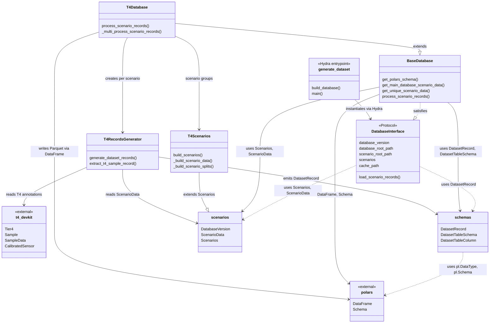

# Database Module

The database module defines how Autoware-ML describes annotation databases and generates dataset records from them. It provides a layered architecture: a shared protocol and base class at the top, with dataset-family-specific implementations (currently T4) underneath. Scenario metadata (splits, versions, sampling parameters) is modelled as immutable Pydantic objects so that every database instance is fully hashable and cacheable.

The Hydra-based entrypoint in `scripts/generate_dataset.py` composes a YAML config that selects the concrete database class and its scenario groups, instantiates the database, and triggers parallel record generation. The output is a stream of `DatasetRecord` rows that can be persisted as Parquet for downstream training or evaluation pipelines.

## Module relationships

| Module                              | Role                                                                          | Depends on                                                                              |
| ----------------------------------- | ----------------------------------------------------------------------------- | --------------------------------------------------------------------------------------- |
| `schemas.py`                        | Defines `DatasetRecord` and `DatasetTableSchema` (output row shape)           | `polars`                                                                                |
| `scenarios.py`                      | Defines `ScenarioData`, `DatabaseVersion`, and abstract `Scenarios` base      | _(none)_                                                                                |
| `database_interface.py`             | `DatabaseInterface` protocol all databases must satisfy                       | `scenarios`, `schemas`                                                                  |
| `base_database.py`                  | `BaseDatabase` shared implementation of `DatabaseInterface`                   | `scenarios`, `schemas`, `polars`                                                        |
| `t4datasets/t4scenarios.py`         | `T4Scenarios` extends `Scenarios` — reads scenario YAML and builds split data | `scenarios`                                                                             |
| `t4datasets/t4records_generator.py` | `T4RecordsGenerator` reads T4 annotations and emits `DatasetRecord`           | `scenarios`, `schemas`, `t4-devkit`                                                     |
| `t4datasets/t4database.py`          | `T4Database` extends `BaseDatabase` — orchestrates parallel record generation | `base_database`, `t4scenarios`, `t4records_generator`, `scenarios`, `schemas`, `polars` |
| `scripts/generate_dataset.py`       | Hydra entrypoint that instantiates a `DatabaseInterface` from config          | `database_interface`                                                                    |

