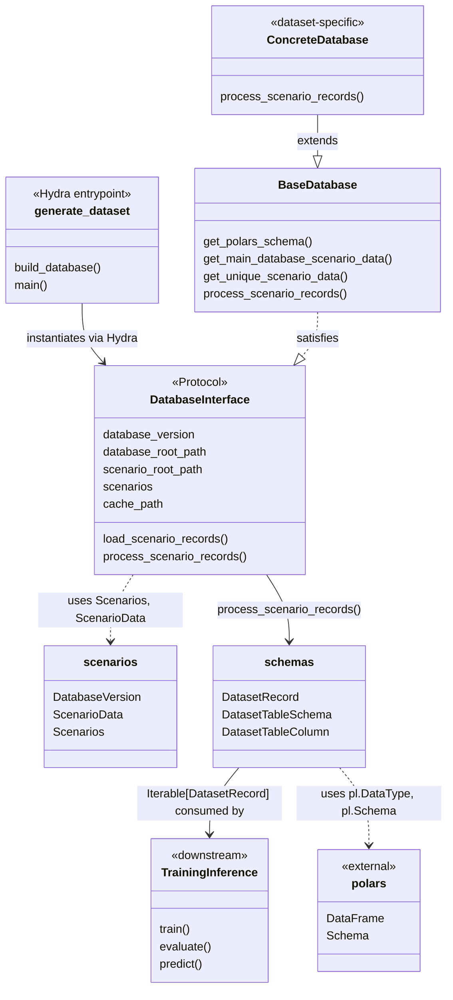

# Database Module

The database module defines how Autoware-ML describes annotation databases and generates dataset records from them. It provides a layered architecture: a shared protocol and base class at the top, with dataset-family-specific implementations underneath. Scenario metadata (splits, versions, sampling parameters) is modelled as immutable Pydantic objects so that every database instance is fully hashable and cacheable.

The Hydra-based entrypoint in `scripts/generate_dataset.py` composes a YAML config that selects the concrete database class and its scenario groups, instantiates the database, and triggers parallel record generation. The output is a stream of `DatasetRecord` rows that can be persisted as Parquet for downstream training or evaluation pipelines.

## Module relationships

| Module                        | Role                                                                     | Depends on                       |
| ----------------------------- | ------------------------------------------------------------------------ | -------------------------------- |
| `schemas.py`                  | Defines `DatasetRecord` and `DatasetTableSchema` (output row shape)      | `polars`                         |
| `scenarios.py`                | Defines `ScenarioData`, `DatabaseVersion`, and abstract `Scenarios` base | _(none)_                         |
| `database_interface.py`       | `DatabaseInterface` protocol all databases must satisfy                  | `scenarios`, `schemas`           |
| `base_database.py`            | `BaseDatabase` shared implementation of `DatabaseInterface`              | `scenarios`, `schemas`, `polars` |
| `scripts/generate_dataset.py` | Hydra entrypoint that instantiates a `DatabaseInterface` from config     | `database_interface`             |

To add a new dataset family, extend `Scenarios` with format-specific YAML parsing, extend `BaseDatabase` with record generation logic, and register the new class in a Hydra config. See `t4datasets/` for a concrete example.

## Schema

The output schema is defined in `schemas.py` and consists of two parts:

- **`DatasetTableSchema`** — a frozen dataclass whose class-level attributes are `DatasetTableColumn` named tuples, each pairing a column name with a Polars data type. Call `DatasetTableSchema.to_polars_schema()` to get a `pl.Schema` for constructing or validating a Polars `DataFrame`.
- **`DatasetRecord`** — a frozen Pydantic model representing a single row. One record is emitted per sample/frame by `process_scenario_records()`.

| Column         | Python type | Polars type | Description                                        |
| -------------- | ----------- | ----------- | -------------------------------------------------- |
| `scenario_id`  | `str`       | `String`    | Unique identifier of the driving scenario          |
| `sample_id`    | `str`       | `String`    | Unique identifier of the individual sample/frame   |
| `sample_index` | `int`       | `Int32`     | Zero-based index of the sample within the scenario |
| `location`     | `str`       | `String`    | Geographic location where the data was captured    |
| `vehicle_type` | `str`       | `String`    | Type of vehicle used for data collection           |

Both classes are kept in sync: every field in `DatasetRecord` has a corresponding column in `DatasetTableSchema`. When adding new annotation fields (e.g. 3D bounding boxes), add entries to both.
