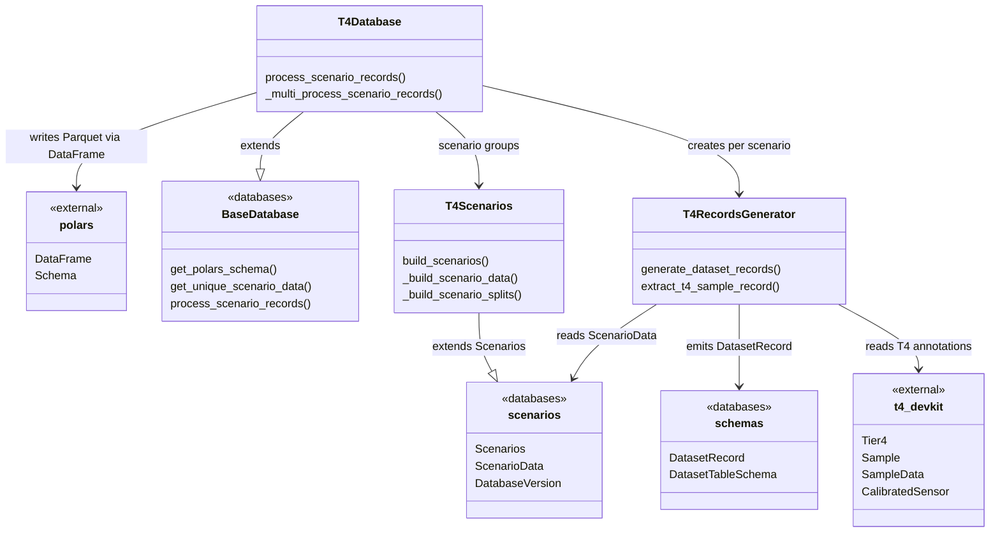

# T4 Datasets

This sub-module implements the database layer for the **T4** annotation format, built on top of the abstract base classes in `databases/`.

## Module relationships

| Module                   | Role                                                                                            | Depends on                                                                              |
| ------------------------ | ----------------------------------------------------------------------------------------------- | --------------------------------------------------------------------------------------- |
| `t4scenarios.py`         | `T4Scenarios` extends `Scenarios`: reads scenario YAML files and builds per-split scenario data | `scenarios`                                                                             |
| `t4records_generator.py` | `T4RecordsGenerator` reads T4 annotations via `t4-devkit` and emits `DatasetRecord`             | `scenarios`, `schemas`, `t4-devkit`                                                     |
| `t4database.py`          | `T4Database` extends `BaseDatabase`: orchestrates parallel record generation across scenarios   | `base_database`, `t4scenarios`, `t4records_generator`, `scenarios`, `schemas`, `polars` |

