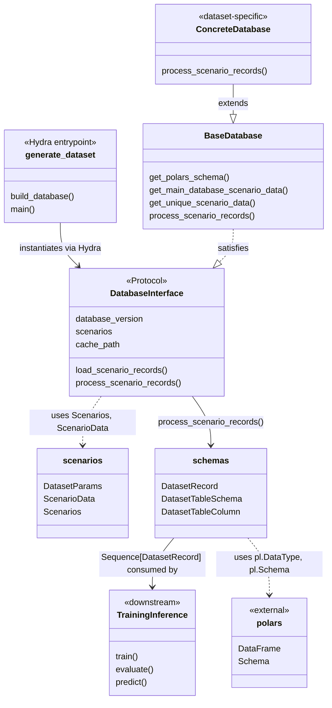

# Database Design

The database module provides a layered architecture for describing annotation databases and generating dataset records. A shared protocol and base class sit at the top, with dataset-family-specific implementations underneath. Scenario metadata (splits, versions, sampling parameters) is modelled as immutable Pydantic objects so that every database instance is fully hashable and cacheable.

## Architecture Overview



## Core Components

### DatabaseInterface

`DatabaseInterface` is the protocol that every database implementation must satisfy. It defines the contract for version metadata, scenario access, and record generation:

```python
class DatabaseInterface(Protocol):
    @property
    def database_version(self) -> str: ...

    @property
    def scenarios(self) -> MappingProxyType[str, Scenarios]: ...

    def get_unique_scenario_data(self) -> MappingProxyType[str, ScenarioData]: ...
    def load_scenario_records(self) -> Sequence[DatasetRecord]: ...
    def process_scenario_records(self) -> Sequence[DatasetRecord]: ...
```

All concrete databases are accessed through this protocol, ensuring downstream code (training, evaluation) never depends on a specific dataset format.

### BaseDatabase

`BaseDatabase` provides the shared implementation of `DatabaseInterface`. It handles initialization from version and paths, caching directory creation, Polars schema retrieval, resolving the main scenario group, and deduplicating scenario data across groups:

```python
class BaseDatabase:
    def __init__(
        self,
        database_version: str,
        database_root_path: str,
        cache_path: str,
        cache_file_prefix_name: str,
        num_workers: int,
    ) -> None:
        ...

    def get_polars_schema(self) -> pl.Schema: ...
    def get_main_database_scenario_data(self) -> Scenarios: ...
    def get_unique_scenario_data(self) -> Mapping[str, ScenarioData]: ...
    def process_scenario_records(self) -> Sequence[DatasetRecord]:
        raise NotImplementedError("Subclasses must implement process_scenario_records!")
```

To add a new dataset family, subclass `BaseDatabase` and implement `process_scenario_records()`. See [T4Dataset](t4dataset.md) for a concrete example.

### Scenarios

The `scenarios` module models scenario metadata as immutable Pydantic objects. `DatasetParams` captures per-dataset preprocessing parameters, `ScenarioData` uniquely identifies a single scenario with its version and sampling settings, and `Scenarios` is the abstract base that concrete implementations extend to parse scenario configs based on a dataset:

```python
class DatasetParams(BaseModel):
    dataset_name: str
    max_sweeps: int
    sample_steps: int

class ScenarioData(BaseModel):
    scenario_id: str
    scenario_version: str
    vehicle_type: str | None = None
    location: str | None = None
    ...

class Scenarios(BaseModel):
    version: str
    scenario_root_path: Path
    dataset_params: Sequence[DatasetParams]
    scenario_data: Mapping[SplitType, Sequence[ScenarioData]] | None = None

    @model_validator(mode="after")
    def build_scenarios(self) -> None:
        raise NotImplementedError("Subclasses must implement build_scenarios!")
```

### Schema

The output schema is defined in `schemas.py` and consists of two parts:

- **`DatasetTableSchema`** — a frozen dataclass whose class-level attributes are `DatasetTableColumn` named tuples, each pairing a column name with a Polars data type. Call `DatasetTableSchema.to_polars_schema()` to get a `pl.Schema` for constructing or validating a Polars `DataFrame`.
- **`DatasetRecord`** — a frozen Pydantic model representing a single row. One record is emitted per sample/frame by `process_scenario_records()`.

```python
class DatasetTableSchema:
    SCENARIO_ID = DatasetTableColumn("scenario_id", pl.String)
    SAMPLE_ID = DatasetTableColumn("sample_id", pl.String)
    SAMPLE_INDEX = DatasetTableColumn("sample_index", pl.Int32)
    LOCATION = DatasetTableColumn("location", pl.String)
    VEHICLE_TYPE = DatasetTableColumn("vehicle_type", pl.String)

    @classmethod
    def to_polars_schema(cls) -> pl.Schema: ...

class DatasetRecord(BaseModel):
    scenario_id: str
    sample_id: str
    sample_index: int
    location: str | None
    vehicle_type: str | None
```

| Column         | Python type    | Polars type | Description                                        |
| -------------- | -------------- | ----------- | -------------------------------------------------- |
| `scenario_id`  | `str`          | `String`    | Unique identifier of the driving scenario          |
| `sample_id`    | `str`          | `String`    | Unique identifier of the individual sample/frame   |
| `sample_index` | `int`          | `Int32`     | Zero-based index of the sample within the scenario |
| `location`     | `str \| None`  | `String`    | Geographic location where the data was captured    |
| `vehicle_type` | `str \| None`  | `String`    | Type of vehicle used for data collection           |

Both classes are kept in sync: every field in `DatasetRecord` has a corresponding column in `DatasetTableSchema`. When adding new annotation fields (e.g. 3D bounding boxes), add entries to both.

### Dataset Generation (Hydra Entrypoint)

The `generate_dataset.py` script is the Hydra-based entrypoint that wires everything together. It reads a YAML config, instantiates the configured database class, and triggers record generation:

```python
@hydra.main(version_base=None, config_path=_CONFIG_PATH)
def main(cfg: DictConfig):
    database: DatabaseInterface = instantiate(cfg.database)
    database.process_scenario_records()
```

To run dataset generation:

```bash
python3 autoware_ml/scripts/generate_dataset.py \
    --config-name default_t4dataset_generator \
    working_dir=<working_dir> \
    data_root_path=<dataset_root_path> \
    database.num_workers=32
```

Configuration is done through YAML files under `autoware_ml/configs/generators/`. Override any parameter from the command line using Hydra syntax. See [Configuration Guide](../user-guide/configuration.md) for full details.

## Extending the Database

| Extension Point      | How                                                                                                          |
| -------------------- | ------------------------------------------------------------------------------------------------------------ |
| New dataset family   | Subclass `BaseDatabase`, implement `process_scenario_records()`, register in a Hydra config                  |
| New scenario format  | Subclass `Scenarios`, implement `build_scenarios()` to parse format-specific YAML                            |
| New schema columns   | Add entries to both `DatasetTableSchema` (Polars type) and `DatasetRecord` (Pydantic field)                  |

## Implementation

| Path                                          | Description                                     |
| --------------------------------------------- | ----------------------------------------------- |
| `autoware_ml/databases/schemas.py`            | `DatasetRecord` and `DatasetTableSchema`        |
| `autoware_ml/databases/scenarios.py`          | `ScenarioData`, `DatasetParams`, `Scenarios`    |
| `autoware_ml/databases/database_interface.py` | `DatabaseInterface` protocol                    |
| `autoware_ml/databases/base_database.py`      | Shared `BaseDatabase` implementation            |
| `autoware_ml/scripts/generate_dataset.py`     | Hydra entrypoint for dataset generation         |
| `autoware_ml/configs/generators/`             | YAML configs for dataset generation             |
