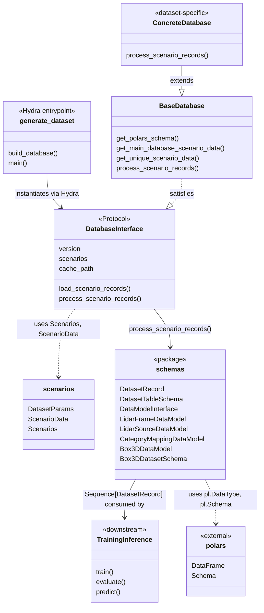

# Database Design

The database module provides a layered architecture for describing annotation databases and generating dataset records. A shared protocol and base class sit at the top, with dataset-family-specific implementations underneath. Scenario metadata (splits, versions, sampling parameters) is modelled as immutable Pydantic objects so that every database instance is fully hashable and cacheable.

## Architecture Overview


```mermaid
classDiagram
    direction TB

    class generate_dataset {
        <<Hydra entrypoint>>
        build_database()
        main()
    }

    class DatabaseInterface {
        <<Protocol>>
        version
        scenarios
        cache_path
        load_scenario_records()
        process_scenario_records()
    }

    class BaseDatabase {
        get_polars_schema()
        get_main_database_scenario_data()
        get_unique_scenario_data()
        process_scenario_records()
    }

    class scenarios {
        DatasetParams
        ScenarioData
        Scenarios
    }

    class schemas {
        <<package>>
        DatasetRecord
        DatasetTableSchema
        DataModelInterface
        LidarFrameDataModel
        LidarSourceDataModel
        CategoryMappingDataModel
        Box3DDataModel
        Box3DDatasetSchema
    }

    class polars {
        <<external>>
        DataFrame
        Schema
    }

    class ConcreteDatabase {
        <<dataset-specific>>
        process_scenario_records()
    }

    class TrainingInference {
        <<downstream>>
        train()
        evaluate()
        predict()
    }

    generate_dataset --> DatabaseInterface : instantiates via Hydra

    DatabaseInterface ..> scenarios : uses Scenarios, ScenarioData
    DatabaseInterface --> schemas : process_scenario_records()

    BaseDatabase ..|> DatabaseInterface : satisfies
    ConcreteDatabase --|> BaseDatabase : extends

    schemas --> TrainingInference : Sequence[DatasetRecord] consumed by

    schemas ..> polars : uses pl.DataType, pl.Schema
```

## Core Components

### DatabaseInterface

`DatabaseInterface` is the protocol that every database implementation must satisfy. It defines the contract for version metadata, scenario access, and record generation:

```python
class DatabaseInterface(Protocol):
    @property
    def version(self) -> str: ...

    @property
    def scenarios(self) -> MappingProxyType[str, Scenarios]: ...

    def get_unique_scenario_data(self) -> MappingProxyType[str, ScenarioData]: ...
    def load_scenario_records(self) -> Sequence[DatasetRecord]: ...
    def process_scenario_records(self) -> None: ...
```

All concrete databases are accessed through this protocol, ensuring downstream code (training, evaluation) never depends on a specific dataset format.

### BaseDatabase

`BaseDatabase` provides the shared implementation of `DatabaseInterface`. It handles initialization from version and paths, caching directory creation, Polars schema retrieval, and deduplicating scenario data across groups:

```python
class BaseDatabase:
    def __init__(
        self,
        version: str,
        root_path: str,
        cache_path: str,
        cache_file_prefix_name: str,
        num_workers: int,
        taxonomy: DatabaseTaxonomy,
        box3d_pipelines: Sequence[Box3DPipeline],
        lidar_intensity_scale: float,
        lidar_pointcloud_num_features: int,
    ) -> None:
        ...

    def get_polars_schema(self) -> pl.Schema: ...
    def get_unique_scenario_data(self) -> MappingProxyType[str, ScenarioData]: ...
    def process_scenario_records(self) -> None:
        raise NotImplementedError("Subclasses must implement process_scenario_records method!")
```

To add a new dataset family, subclass `BaseDatabase` and implement `process_scenario_records()`. See [T4Dataset](t4dataset.md) for a concrete example.

### Scenarios

The `scenarios` module models scenario metadata as immutable Pydantic objects. `DatasetParams` captures per-dataset preprocessing parameters, `ScenarioData` uniquely identifies a single scenario with its version and sampling settings, and `Scenarios` is the abstract base that concrete implementations extend to parse scenario configs based on a dataset:

```python
class DatasetParams(BaseModel):
    dataset_name: str
    max_past_sweeps: int
    max_future_sweeps: int
    sample_steps: int

class ScenarioData(BaseModel):
    dataset_params: DatasetParams
    scenario_id: str
    scenario_version: str
    vehicle_type: str | None = None
    location: str | None = None

class Scenarios(BaseModel):
    scenario_root_path: Path
    dataset_params: Sequence[DatasetParams]
    scenario_data: Mapping[SplitType, Sequence[ScenarioData]] | None = None

    @model_validator(mode="after")
    def build_scenarios(self) -> Scenarios:
        raise NotImplementedError("Subclasses must implement build_scenarios!")
```

### Label sets, category aliases and record options

A taxonomy level may declare `class_sets`: named groups of at least two of its classes. A fine
label mapped to a set names a point that belongs to one of the set's classes without saying
which. Such points resolve to the label index `num_classes + k` for set `k`; the segmentation
head trains the summed probability of the set for them (cross entropy of the marginal, also
after the voxel reduction of the targets), leaves them out of the Lovasz term, and every
metric skips them because the target is outside the class range. This is how a corpus
annotated at a coarser specification than the level supervises exactly what it knows instead
of forcing a guess. The `foundation` level uses it for the old J6 gen2 specification
(`manmade` covering poles, signs and barriers; curbs inside the flat surfaces) and for the
pseudo labels predicted at that specification.

Raw category names are shared across corpora, but their meaning is not: `sidewalk` in the old
specification still contains the curbs, in the new one it does not. A dataset's
`DatasetParams.category_aliases` maps such raw names to alias names (`legacy_sidewalk`) when
its record table is generated; the vocabulary of the level lists the aliases as fine names of
their own and the level maps them to the class or set they mean there. Only the foundation
vocabularies list the aliases, so a corpus with aliases is bound to that level.

`DatasetParams` also carries `semantic_masks` (keep only the samples whose LiDAR frame has a
semantic mask, for a corpus labelled at a lower rate than it was recorded) and `camera_frames`
(off for a LiDAR only corpus or a mirror without the images). These options, the aliases and
the label sets enter the database hash only when they differ from their defaults, so the
record tables of every other database keep their hash.

### Schema

`process_scenario_records()` writes the records of every scenario to a Parquet file. `BaseDatabase.get_polars_schema()` delegates to `DatasetTableSchema` so records can be serialized to Parquet via `DatasetRecord.to_dictionary()`.

The schema is defined in the `autoware_ml/databases/schemas/` package and covers basic frame metadata, nested LiDAR structs, and annotation fields such as category mapping and 3D boxes. The 3D box payload is modeled by `Box3DDataModel` with its struct layout defined in `Box3DDatasetSchema`, and is stored in the top-level `boxes_3d` list column. See [Dataset Schema](schemas.md) for the full column layout, nested data models, and extension guide.

### Dataset Generation (Hydra Entrypoint)

The `generate_dataset.py` script is the Hydra-based entrypoint that wires everything together. It reads a YAML config, instantiates the configured database class, and triggers record generation:

```python
@hydra.main(version_base=None, config_path=_CONFIG_PATH)
def main(cfg: DictConfig):
    database: DatabaseInterface = instantiate(cfg.database)
    database.process_scenario_records()
```

To run dataset generation:

```bash
python3 autoware_ml/scripts/generate_dataset.py \
    --config-name default_t4dataset_generator \
    working_dir=<working_dir> \
    data_root_path=<data_root_path> \
    database.num_workers=32
```

Configuration is done through YAML files under `autoware_ml/configs/generators/`. Override any parameter from the command line using Hydra syntax. See [Configuration Guide](../user-guide/configuration.md) for full details.

## Extending the Database

| Extension Point      | How                                                                                                          |
| -------------------- | ------------------------------------------------------------------------------------------------------------ |
| New dataset family   | Subclass `BaseDatabase`, implement `process_scenario_records()`, register in a Hydra config                  |
| New scenario format  | Subclass `Scenarios`, implement `build_scenarios()` to parse format-specific YAML                            |
| New schema columns   | See [Dataset Schema](schemas.md)                                                                             |

## Implementation

| Path                                          | Description                                           |
| --------------------------------------------- | ----------------------------------------------------- |
| `autoware_ml/databases/schemas/`              | Dataset schema package, see [schemas.md](schemas.md)  |
| `autoware_ml/databases/scenarios.py`          | `ScenarioData`, `DatasetParams`, `Scenarios`          |
| `autoware_ml/databases/database_interface.py` | `DatabaseInterface` protocol                          |
| `autoware_ml/databases/base_database.py`      | Shared `BaseDatabase` implementation                  |
| `autoware_ml/scripts/generate_dataset.py`     | Hydra entrypoint for dataset generation               |
| `autoware_ml/configs/generators/`             | YAML configs for dataset generation                   |
