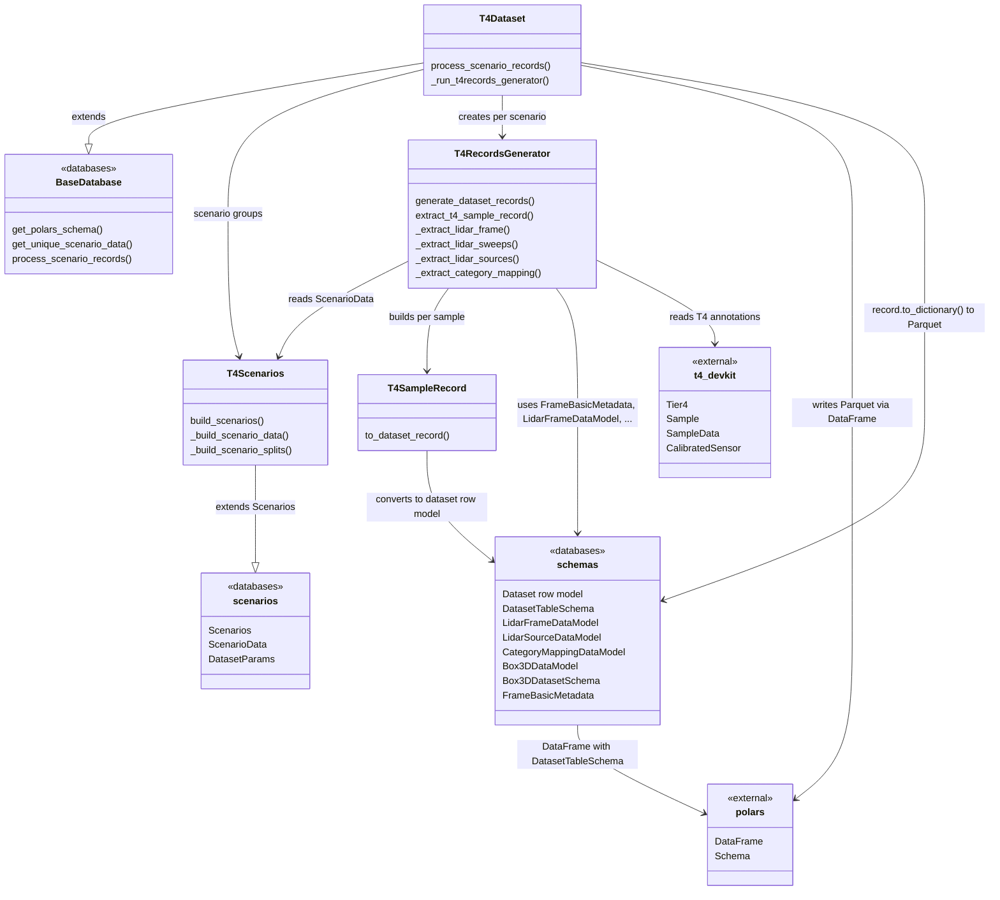

# T4Dataset

This module implements the database layer for the **T4** annotation format, built on top of the abstract base classes in the [database module](design.md).

## Summary

| Property     | Value                                                       |
| ------------ | ----------------------------------------------------------- |
| Format       | JSON (T4 annotation tables via `t4-devkit`)                 |
| Annotations  | 3D bounding boxes                                           |
| Modality     | Multiple LiDAR (+ cameras in source data, not yet exported) |
| Dependencies | `t4-devkit`, `polars`, `numpy`                              |
| Input        | Scenario YAML files and T4 annotation directories           |
| Output       | Sequence of dataset rows saved as Parquet via Polars        |

## Module relationships

| Module                   | Role                                                                                              | Depends on                                                                              |
| ------------------------ | ------------------------------------------------------------------------------------------------- | --------------------------------------------------------------------------------------- |
| `t4scenarios.py`         | `T4Scenarios` extends `Scenarios`: reads scenario YAML files and builds per-split scenario data   | `scenarios`                                                                             |
| `t4records_generator.py` | `T4RecordsGenerator` reads T4 annotations via `t4-devkit` and builds `T4SampleRecord` per sample  | `scenarios`, `schemas`, `t4-devkit`                                                     |
| `t4sample_records.py`    | `T4SampleRecord` holds intermediate per-sample data and converts to the unified dataset row model | `schemas`                                                                               |
| `t4dataset.py`           | `T4Dataset` extends `BaseDatabase`: orchestrates parallel record generation across scenarios      | `base_database`, `t4scenarios`, `t4records_generator`, `scenarios`, `schemas`, `polars` |

## Output table schema

`T4Dataset.process_scenario_records()` produces a list of `DatasetRecord` objects and persists them as a Polars `DataFrame` written to Parquet. For the complete table layout and nested struct definitions, see [Dataset Schema](schemas.md).

Each row corresponds to one `DatasetRecord` (a frozen Pydantic model). The Parquet file is cached under the database's `cache_path` with a filename derived from the database hash for reproducibility.

## Implementation

| Path                                                     | Description                                                      |
| -------------------------------------------------------- | -----------------------------------------------------------------|
| `autoware_ml/databases/t4dataset/t4scenarios.py`         | T4 scenario YAML parsing and split construction                  |
| `autoware_ml/databases/t4dataset/t4records_generator.py` | T4 annotation reading and per-sample extraction                  |
| `autoware_ml/databases/t4dataset/t4sample_records.py`    | Intermediate `T4SampleRecord` to unified dataset row conversion  |
| `autoware_ml/databases/t4dataset/t4dataset.py`           | T4 database orchestration with parallel processing               |
| `autoware_ml/databases/scenarios.py`                     | Base scenario models (`Scenarios`, `ScenarioData`)               |
| `autoware_ml/databases/schemas/dataset_schemas.py`       | Unified dataset row model and `DatasetTableSchema` definitions   |
| `autoware_ml/databases/schemas/lidar_frames.py`          | LiDAR frame struct schema and data model                         |
| `autoware_ml/databases/schemas/lidar_sources.py`         | LiDAR source struct schema and data model                        |
| `autoware_ml/databases/schemas/category_mapping.py`      | Category mapping struct schema and data model                    |
| `autoware_ml/databases/schemas/box3d_datamodel.py`       | 3D box struct schema and data model                              |
| `autoware_ml/databases/schemas/frame_basic_metadata.py`  | Shared per-frame metadata model                                  |
| `autoware_ml/databases/base_database.py`                 | Shared `BaseDatabase` implementation                             |
| `autoware_ml/scripts/generate_dataset.py`                | Hydra entrypoint for dataset generation                          |

## Acknowledgment

T4Dataset is based on the nuScenes dataset schema.

<!-- cspell:ignore Bankiti Liong Krishnan Baldan Beijbom Vora -->
- Repository: <https://github.com/nutonomy/nuscenes-devkit>
- License: Apache 2.0
- Paper: Caesar, H., Bankiti, V., Lang, A. H., Vora, S., Liong, V. E., Xu, Q., Krishnan, A., Pan, Y., Baldan, G., and Beijbom, O. "nuScenes: A Multimodal Dataset for Autonomous Driving." CVPR, 2020.
