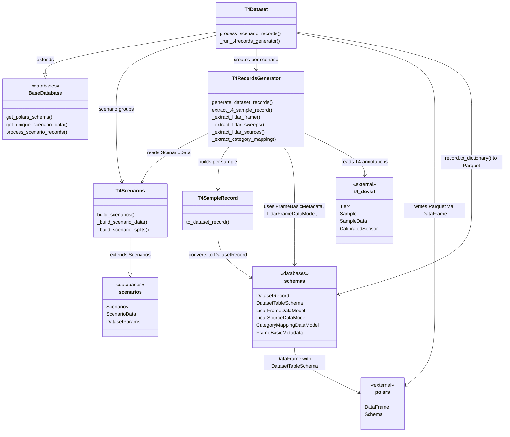

# T4Dataset

This module implements the database layer for the **T4** annotation format, built on top of the abstract base classes in the [database module](design.md).

## Summary

| Property     | Value                                                       |
| ------------ | ----------------------------------------------------------- |
| Format       | JSON (T4 annotation tables via `t4-devkit`)                 |
| Annotations  | 3D bounding boxes                                           |
| Modality     | Multiple LiDAR (+ cameras in source data, not yet exported) |
| Dependencies | `t4-devkit`, `polars`, `numpy`                              |
| Input        | Scenario YAML files and T4 annotation directories           |
| Output       | `Sequence[DatasetRecord]` saved as Parquet via Polars       |

## Module relationships

| Module                   | Role                                                                                             | Depends on                                                                              |
| ------------------------ | ------------------------------------------------------------------------------------------------ | --------------------------------------------------------------------------------------- |
| `t4scenarios.py`         | `T4Scenarios` extends `Scenarios`: reads scenario YAML files and builds per-split scenario data  | `scenarios`                                                                             |
| `t4records_generator.py` | `T4RecordsGenerator` reads T4 annotations via `t4-devkit` and builds `T4SampleRecord` per sample | `scenarios`, `schemas`, `t4-devkit`                                                     |
| `t4sample_records.py`    | `T4SampleRecord` holds intermediate per-sample data and converts to `DatasetRecord`              | `schemas`                                                                               |
| `t4dataset.py`           | `T4Dataset` extends `BaseDatabase`: orchestrates parallel record generation across scenarios     | `base_database`, `t4scenarios`, `t4records_generator`, `scenarios`, `schemas`, `polars` |

## Output table schema

`T4Dataset.process_scenario_records()` produces a list of `DatasetRecord` objects and persists them as a Polars `DataFrame` written to Parquet. Each record is serialized via `DatasetRecord.to_dictionary()` using [DatasetTableSchema](schemas.md). The tables below describe the T4-specific field layout.

### Top-level columns

| Column              | Polars type    | Description                                      |
| ------------------- | -------------- | ------------------------------------------------ |
| `scenario_id`       | `String`       | Unique identifier of the driving scenario        |
| `sample_id`         | `String`       | Unique identifier of the individual sample/frame |
| `sample_index`      | `Int32`        | Zero-based index of the sample within scenario   |
| `timestamp_seconds` | `Float64`      | Sample timestamp in seconds                      |
| `location`          | `String`       | Geographic location where data was captured      |
| `vehicle_type`      | `String`       | Type of vehicle used for data collection         |
| `scenario_name`     | `String`       | Human-readable name of the scenario scene        |
| `lidar_frames`      | `List(Struct)` | Keyframe and sweep LiDAR metadata (see below)    |
| `lidar_sources`     | `List(Struct)` | Per-sensor LiDAR calibration (see below)         |
| `category_mapping`  | `Struct`       | Category name-to-index mapping (see below)       |

### `lidar_frames` struct fields

Each list entry is a `LidarFrameDataModel` covering one keyframe or sweep:

| Field                                   | Polars type           | Description                                              |
| --------------------------------------- | --------------------- | -------------------------------------------------------- |
| `lidar_frame_id`                        | `String`              | Sample-data token for this frame                         |
| `lidar_keyframe`                        | `Boolean`             | `True` for the main keyframe, `False` for sweeps         |
| `lidar_sensor_id`                       | `String`              | Calibrated-sensor token                                  |
| `lidar_sensor_channel_name`             | `String`              | LiDAR channel name (e.g. `LIDAR_TOP`)                    |
| `lidar_timestamp_seconds`               | `Float64`             | Frame timestamp in seconds                               |
| `lidar_pointcloud_path`                 | `String`              | Absolute path to the point cloud file                    |
| `lidar_pointcloud_source_path`          | `String`              | Path to per-point metadata (or null)                     |
| `lidar_pointcloud_num_features`         | `Int32`               | Number of features per point (configured on `T4Dataset`) |
| `lidar_sensor_to_ego_pose_matrix`       | `Array(Float32, 4×4)` | Sensor-to-ego transform                                  |
| `lidar_frame_ego_pose_to_global_matrix` | `Array(Float32, 4×4)` | Ego-to-global transform for this frame                   |
| `lidar_sensor_to_lidar_sweep_matrices`  | `Array(Float32, 4×4)` | Sensor-to-sweep transform                                |
| `lidar_pointcloud_semantic_mask_path`   | `String`              | LiDAR segmentation mask path (or null)                   |

### `lidar_sources` struct fields

Each list entry is a `LidarSourceDataModel` describing one LiDAR sensor in the scene:

| Field          | Polars type           | Description               |
| -------------- | --------------------- | ------------------------- |
| `channel_name` | `String`              | Sensor channel name       |
| `sensor_token` | `String`              | Sensor token              |
| `translation`  | `Array(Float32, 3)`   | Sensor translation vector |
| `rotation`     | `Array(Float32, 3×3)` | Sensor rotation matrix    |

### `category_mapping` struct fields

| Field              | Polars type     | Description                          |
| ------------------ | --------------- | ------------------------------------ |
| `category_names`   | `List(String)`  | Ordered list of category names       |
| `category_indices` | `List(Int32)`   | Corresponding category index values  |

Each row corresponds to one `DatasetRecord` (a frozen Pydantic model). The Parquet file is cached under the database's `cache_path` with a filename derived from the database hash for reproducibility.

## Implementation

| Path                                                     | Description                                                 |
| -------------------------------------------------------- | ----------------------------------------------------------- |
| `autoware_ml/databases/t4dataset/t4scenarios.py`         | T4 scenario YAML parsing and split construction             |
| `autoware_ml/databases/t4dataset/t4records_generator.py` | T4 annotation reading and per-sample extraction             |
| `autoware_ml/databases/t4dataset/t4sample_records.py`    | Intermediate `T4SampleRecord` to `DatasetRecord` conversion |
| `autoware_ml/databases/t4dataset/t4dataset.py`           | T4 database orchestration with parallel processing          |
| `autoware_ml/databases/scenarios.py`                     | Base scenario models (`Scenarios`, `ScenarioData`)          |
| `autoware_ml/databases/schemas/dataset_schemas.py`       | `DatasetRecord` and `DatasetTableSchema` definitions        |
| `autoware_ml/databases/schemas/lidar_frames.py`          | LiDAR frame struct schema and data model                    |
| `autoware_ml/databases/schemas/lidar_sources.py`         | LiDAR source struct schema and data model                   |
| `autoware_ml/databases/schemas/category_mapping.py`      | Category mapping struct schema and data model               |
| `autoware_ml/databases/schemas/frame_basic_metadata.py`  | Shared per-frame metadata model                             |
| `autoware_ml/databases/base_database.py`                 | Shared `BaseDatabase` implementation                        |
| `autoware_ml/scripts/generate_dataset.py`                | Hydra entrypoint for dataset generation                     |

## Acknowledgment

T4Dataset is based on the nuScenes dataset schema.

<!-- cspell:ignore Bankiti Liong Krishnan Baldan Beijbom Vora -->
- Repository: <https://github.com/nutonomy/nuscenes-devkit>
- License: Apache 2.0
- Paper: Caesar, H., Bankiti, V., Lang, A. H., Vora, S., Liong, V. E., Xu, Q., Krishnan, A., Pan, Y., Baldan, G., and Beijbom, O. "nuScenes: A Multimodal Dataset for Autonomous Driving." CVPR, 2020.
