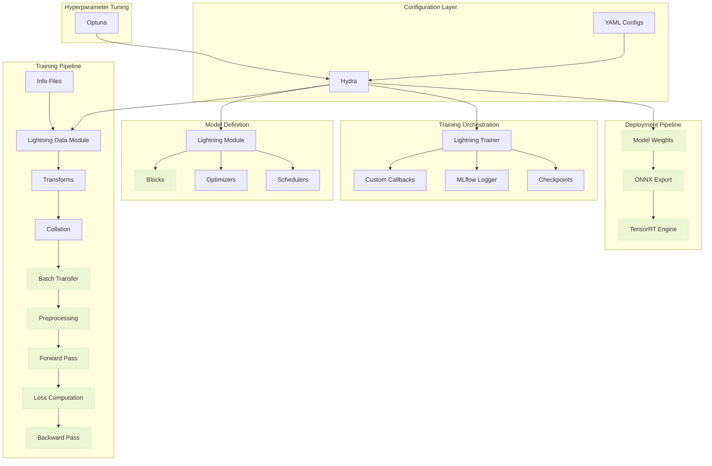

# Framework Design

Autoware-ML is built on a modular architecture that separates concerns into key components including configuration, data handling, model definition, training, and deployment, among others. This design makes it easy to add new models and datasets while reusing common infrastructure.

## Architecture Overview



**Legend:** <span style="display: inline-block; width: 12px; height: 12px; background-color: #42a5f5; border: 1px solid #1976d2; margin-right: 4px; vertical-align: middle;"></span> CPU operations | <span style="display: inline-block; width: 12px; height: 12px; background-color: #66bb6a; border: 1px solid #388e3c; margin-right: 4px; vertical-align: middle;"></span> GPU operations

## Core Components

### Configuration (Hydra)

Everything in Autoware-ML is configured through YAML files processed by [Hydra](https://hydra.cc/). This enables:

- **Hierarchical configs** - Inherit from base configs, override specific values
- **Runtime overrides** - Change any parameter from the command line
- **Automatic instantiation** - `_target_` keys specify Python classes to instantiate via `hydra.utils.instantiate()`

See [Configuration Guide](../user-guide/configuration.md) for full details on Hydra syntax.

### Data Module

The `DataModule` class (extending `LightningDataModule`) manages:

- Dataset creation for each split (train/val/test/predict)
- DataLoader configuration (batch size, workers, shuffling, pin_memory, etc.)
- Transforms (CPU-side augmentations per split)
- Collation (batching samples together, stacking selected keys)
- Preprocessing (GPU-side transforms after batch transfer)

```python
class DataModule(L.LightningDataModule, ABC):
    def __init__(
        self,
        stack_keys: Optional[List[str]] = None,
        train_transforms: Optional[TransformsCompose] = None,
        val_transforms: Optional[TransformsCompose] = None,
        test_transforms: Optional[TransformsCompose] = None,
        predict_transforms: Optional[TransformsCompose] = None,
        data_preprocessing: Optional[DataPreprocessing] = None,
        train_dataloader_cfg: Optional[DataLoaderConfig] = None,
    ):
        ...

    @abstractmethod
    def _create_dataset(
        self, split: str, transforms: Optional[TransformsCompose] = None
    ) -> Dataset:
        ...

    def collate_fn(self, batch_inputs_dicts: List[Dict[str, Any]]) -> Dict[str, Any]:
        ...

    def on_after_batch_transfer(
        self, batch_inputs_dict: Dict[str, Any], dataloader_idx: int
    ) -> Dict[str, Any]:
        if self.data_preprocessing is not None:
            batch_inputs_dict = self.data_preprocessing(batch_inputs_dict)
        return batch_inputs_dict
```

The `Dataset` base class handles transforms application:

```python
class Dataset(TorchDataset, ABC):
    def __getitem__(self, index: int) -> Dict[str, Any]:
        input_dict = self._get_input_dict(index)
        input_dict = self._transform(input_dict)
        return input_dict

    @abstractmethod
    def _get_input_dict(self, index: int) -> Dict[str, Any]:
        ...
```

### Transforms

Transforms are composable data augmentations applied per-sample on CPU. They follow a dict-in/dict-out pattern where each transform receives a dictionary and returns updates to merge back.

```python
class BaseTransform(ABC):
    def __call__(self, input_dict: Dict[str, Any]) -> Dict[str, Any]:
        return self.transform(input_dict)

    @abstractmethod
    def transform(self, input_dict: Dict[str, Any]) -> Dict[str, Any]:
        ...

class TransformsCompose:
    def __init__(self, pipeline: Optional[List[BaseTransform]] = None):
        self.pipeline = pipeline or []

    def __call__(self, input_dict: Dict[str, Any]) -> Dict[str, Any]:
        for transform in self.pipeline:
            input_dict |= transform(input_dict)
        return input_dict
```

Transforms are configured per split (train/val/test/predict) in the `DataModule` and applied during `Dataset.__getitem__()`.

### Preprocessing

Preprocessing runs on GPU after batch transfer, enabling hardware-accelerated operations. It follows the same dict-in/dict-out pattern as transforms but operates on batched tensors.

```python
class DataPreprocessing(nn.Module):
    def __init__(self, pipeline: Optional[List[nn.Module]] = None):
        super().__init__()
        self.pipeline = nn.ModuleList(pipeline or [])

    def __call__(self, batch_inputs_dict: Dict[str, Any]) -> Dict[str, Any]:
        for layer in self.pipeline:
            batch_inputs_dict |= layer(batch_inputs_dict)
        return batch_inputs_dict
```

The `DataModule.on_after_batch_transfer()` method automatically applies preprocessing if configured. Each preprocessing layer is an `nn.Module` that operates on batched tensors already on the target device.

### Model

All models inherit from `BaseModel` (extending `LightningModule`), which provides a standard interface:

```python
class BaseModel(L.LightningModule, ABC):
    def __init__(
        self,
        optimizer: Optional[Callable[..., Optimizer]] = None,
        scheduler: Optional[Callable[[Optimizer], LRScheduler]] = None,
    ):
        super().__init__()
        self.forward_signature = inspect.signature(self.forward)
        self.compute_metrics_signature = inspect.signature(self.compute_metrics)
        ...

    @abstractmethod
    def forward(self, **kwargs: Any) -> Union[torch.Tensor, Sequence[torch.Tensor]]:
        ...

    @abstractmethod
    def compute_metrics(
        self, outputs: Union[torch.Tensor, Sequence[torch.Tensor]], **kwargs: Any
    ) -> Dict[str, torch.Tensor]:
        ...

    def configure_optimizers(self) -> Union[Optimizer, Dict[str, Any]]:
        ...
```

The base class handles:

- **Unified step logic** - All models share the same step logic for training, validation, test and predict steps
- **Automatic signature inspection** - Only passes relevant kwargs to `forward()` and `compute_metrics()` based on method signatures captured at initialization
- **Metric logging** - Logs metrics to Lightning's logger with proper prefixes
- **Predict step** - Handles prediction without computing metrics

Models can have **any internal architecture**. The framework only requires implementing the abstract interface. The base class automatically filters batch inputs to match each method's signature using `inspect.signature()`.

!!! warning
    `forward()` and `compute_metrics()` argument names must match the keys in the batch dictionary.

### Deployment Pipeline

The deployment pipeline exports trained models to production-ready formats:

```mermaid
flowchart LR
    subgraph ONNXExport [ONNX Export]
        Checkpoint[Checkpoint] --> Load[Load Weights]
        Load --> Model[Model Eval Mode]
        Model --> Trace[Trace with Sample]
        Trace --> ONNX[ONNX File]
    end

    subgraph TensorRTBuild [TensorRT Build]
        ONNX --> Parse[Parse ONNX]
        Parse --> Optimize[Build Engine]
        Optimize --> EngineFile[Engine File]
    end

    style Checkpoint fill:#a5d6a7,opacity:0.2,stroke:#05bc23
    style Load fill:#a5d6a7,opacity:0.2,stroke:#05bc23
    style Model fill:#a5d6a7,opacity:0.2,stroke:#05bc23
    style Trace fill:#a5d6a7,opacity:0.2,stroke:#05bc23
    style ONNX fill:#a5d6a7,opacity:0.2,stroke:#05bc23
    style Parse fill:#a5d6a7,opacity:0.2,stroke:#05bc23
    style Optimize fill:#a5d6a7,opacity:0.2,stroke:#05bc23
    style EngineFile fill:#a5d6a7,opacity:0.2,stroke:#05bc23
```



The deployment process:

1. **Load checkpoint** - Instantiates model from config and loads weights from checkpoint
2. **Get input sample** - Uses the predict dataloader to obtain a sample matching the model's forward signature
3. **Export to ONNX** - Traces the model with the input sample, supporting dynamic shapes for variable input sizes
4. **Build TensorRT engine** - Optimizes the ONNX model for inference on NVIDIA GPUs with configurable optimization profile

Configuration is done through the `deploy` section in task configs.

## Extending the Framework

| Extension Point | How                                                                 |
| --------------- | ------------------------------------------------------------------- |
| New model       | Subclass `BaseModel`, implement `forward()` and `compute_metrics()` |
| New dataset     | Subclass `DataModule` and `Dataset`                                 |
| New transform   | Subclass `BaseTransform`, implement `transform()`                   |
| New task        | Create config in `configs/tasks/`                                   |

See [Adding Models](../extending/adding-models.md) for a detailed guide.
