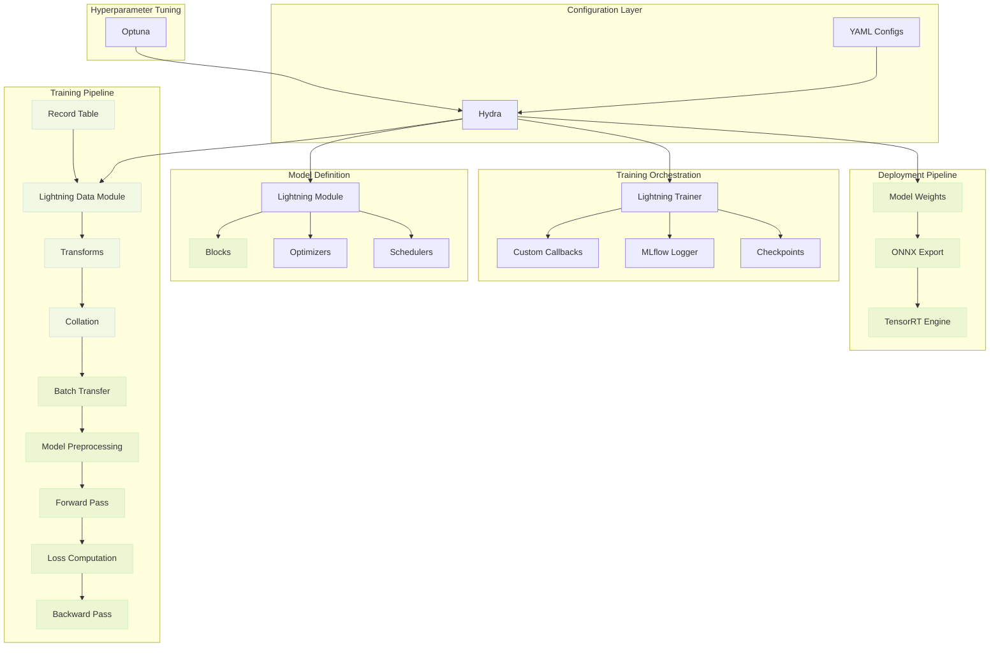

# Framework Design

Autoware-ML is built on a modular architecture that separates concerns into key components including configuration, data handling, model definition, training, and deployment, among others. This design makes it easy to add new models and datasets while reusing common infrastructure.

## Architecture Overview


```mermaid
flowchart TB
    subgraph Optimization [Hyperparameter Tuning]
        Optuna[Optuna]
    end

    subgraph Configuration [Configuration Layer]
        YAML[YAML Configs]
        Optuna --> Hydra[Hydra]
        YAML --> Hydra
    end

    subgraph TrainingPipeline [Training Pipeline]
        RecordTable[Record Table]
        RecordTable --> LightningDataModule[Lightning Data Module]
        LightningDataModule --> Transforms[Transforms]
        Transforms --> Collation[Collation]
        Collation --> BatchTransfer[Batch Transfer]
        BatchTransfer --> Preprocessing[Model Preprocessing]
        Preprocessing --> ForwardPass[Forward Pass]
        ForwardPass --> LossComputation[Loss Computation]
        LossComputation --> BackwardPass[Backward Pass]
    end

    subgraph ModelLayer [Model Definition]
        LightningModule[Lightning Module]
        LightningModule --> Blocks["Blocks"]
        LightningModule --> Optimizers["Optimizers"]
        LightningModule --> Schedulers["Schedulers"]
    end

    subgraph TrainingLoop [Training Orchestration]
        Trainer[Lightning Trainer]
        Trainer --> CustomCallbacks[Custom Callbacks]
        Trainer --> MLflow[MLflow Logger]
        Trainer --> Checkpoints[Checkpoints]
    end

    subgraph Deployment [Deployment Pipeline]
        ModelWeights[Model Weights]
        ModelWeights --> ONNXExport[ONNX Export]
        ONNXExport --> TensorRTEngine[TensorRT Engine]
    end

    Hydra --> LightningDataModule
    Hydra --> LightningModule
    Hydra --> Trainer
    Hydra --> ModelWeights

    style RecordTable fill:#bbdefb,opacity:0.2,stroke:#1976d2
    style LightningDataModule fill:#bbdefb,opacity:0.2,stroke:#1976d2
    style Transforms fill:#bbdefb,opacity:0.2,stroke:#1976d2
    style Collation fill:#bbdefb,opacity:0.2,stroke:#1976d2
    style ModelWeights fill:#a5d6a7,opacity:0.2,stroke:#05bc23
    style ONNXExport fill:#a5d6a7,opacity:0.2,stroke:#05bc23
    style TensorRTEngine fill:#a5d6a7,opacity:0.2,stroke:#05bc23
    style Blocks fill:#a5d6a7,opacity:0.2,stroke:#05bc23
    style BatchTransfer fill:#a5d6a7,opacity:0.2,stroke:#05bc23
    style Preprocessing fill:#a5d6a7,opacity:0.2,stroke:#05bc23
    style ForwardPass fill:#a5d6a7,opacity:0.2,stroke:#05bc23
    style LossComputation fill:#a5d6a7,opacity:0.2,stroke:#05bc23
    style BackwardPass fill:#a5d6a7,opacity:0.2,stroke:#05bc23
```

**Legend:** <span style="display: inline-block; width: 12px; height: 12px; background-color: #42a5f5; border: 1px solid #1976d2; margin-right: 4px; vertical-align: middle;"></span> CPU operations | <span style="display: inline-block; width: 12px; height: 12px; background-color: #66bb6a; border: 1px solid #388e3c; margin-right: 4px; vertical-align: middle;"></span> GPU operations

## Core Components

### Configuration (Hydra)

Everything in Autoware-ML is configured through YAML files processed by [Hydra](https://hydra.cc/). This enables:

- **Hierarchical configs** - Inherit from base configs, override specific values
- **Runtime overrides** - Change any parameter from the command line
- **Automatic instantiation** - `_target_` keys specify Python classes to instantiate via `hydra.utils.instantiate()`

See [Configuration Guide](../user-guide/configuration.md) for full details on Hydra syntax.

### Data Module

The data pipeline reads the record table of a database. A database turns its raw annotations
into one Parquet table with a row per lidar frame, see [Database Design](../databases/design.md).

`DataModule` (extending `LightningDataModule`) builds the datasets of every split from that
table:

- `prepare_data()` generates the record table of every database the splits read, once
- `setup()` splits each table by the scenario lists of its database and builds one dataset per
  dataset source of a split
- every split gets its own dataloader settings (batch size, workers, shuffling, pin_memory)

```python
class DataModule(L.LightningDataModule):
    def __init__(
        self,
        splitter: SplitterInterface,
        train_sources: Sequence[Mapping[str, Any]] | None,
        validation_sources: Sequence[Mapping[str, Any]] | None,
        test_sources: Sequence[Mapping[str, Any]] | None,
        predict_sources: Sequence[Mapping[str, Any]] | None,
        train_dataset: Callable[..., BaseDataset] | None,
        validation_dataset: Callable[..., BaseDataset] | None,
        test_dataset: Callable[..., BaseDataset] | None,
        predict_dataset: Callable[..., BaseDataset] | None,
        train_dataloader: DataLoaderConfig | None,
        validation_dataloader: DataLoaderConfig | None,
        test_dataloader: DataLoaderConfig | None,
        predict_dataloader: DataLoaderConfig | None,
        train_frame_sampling: FrameSamplingConfig | None,
    ) -> None:
        ...
```

A `DatasetSource` names one database, whether its boxes (`det3d`) and semantic masks (`seg3d`)
supervise the run, and how many times its frames appear in one epoch (`repeat`). A split with
several sources mixes their corpora. A source with a task turned off still serves that task,
with an empty box set or ignored point labels, so every sample of the split collates with the
others. All sources of a datamodule must share one taxonomy.

The dataset factory of a split is a partial dataset config. The datamodule completes it with
the root path, the records and the supervision of each source, and concatenates the datasets
of a split in declaration order.

### Dataset

`BaseDataset` turns one record into a `ModelGTSample` and runs the transforms on it:

```python
class BaseDataset(Dataset):
    def __getitem__(self, index: int) -> ModelGTSample:
        model_gt_sample = self.get_data_sample(index)
        return self.apply_transforms(model_gt_sample)

    @abstractmethod
    def get_data_sample(self, index: int) -> ModelGTSample:
        ...

    def collate_fn(self, batch: Sequence[ModelGTSample]) -> ModelGTBatch:
        ...
```

`T4Dataset` implements it for T4 databases, and `NuScenesDataset` extends it for nuScenes. The
annotations of each task come from a task dataset deriving `BaseDatasetTask`, such as
`T4Detection3DTask` and `T4Segmentation3DTask`. A dataset config lists its task datasets under
`dataset_tasks`, so one dataset class serves detection, segmentation or both. The dataset config
leaves its transforms required (`???`), and every model sets the pipeline of each split in its
task config.

`get_data_sample()` returns the sensor file paths, calibration and annotations of a record. Point
clouds and images are loaded by the transforms. The collate function stacks the samples into a
typed `ModelGTBatch`.

### Transforms

Transforms are composable data augmentations applied per sample on CPU. Each transform takes a
`ModelGTSample` and returns the updated sample.

```python
class BaseTransform(ABC):
    _required_keys: Sequence[str] = ()

    def __call__(self, model_gt_sample: ModelGTSample) -> ModelGTSample:
        self._validate_required_keys(model_gt_sample)
        if not self._should_apply():
            return self.on_skip(model_gt_sample)
        return self.transform(model_gt_sample)

    @abstractmethod
    def transform(self, model_gt_sample: ModelGTSample) -> ModelGTSample:
        ...

class TransformsCompose:
    def __init__(self, pipeline: Sequence[BaseTransform]):
        self.pipeline = pipeline

    def __call__(self, model_gt_sample: ModelGTSample) -> ModelGTSample:
        for transform in self.pipeline:
            model_gt_sample = transform(model_gt_sample)
        return model_gt_sample
```

Every dataset config carries its own `transforms`, so each split has its own pipeline. The
dataset applies it in `__getitem__()`.

Public transform targets should reference the concrete implementation module, for example
`autoware_ml.transforms.point_cloud.loading.LoadPointsFromFile` or
`autoware_ml.transforms.point_cloud.geometry.GlobalBEVRandomFlip`. Avoid package-level re-export
layers in `__init__.py`. Imports and Hydra `_target_` paths should point at the implementation
module directly.

### Runtime Data Preprocessing

Runtime preprocessing is a model-owned pipeline attached through
`BaseModel.set_data_preprocessing(...)`. It runs on the target device after
Lightning moves the batch over, and before the model's `forward()`.

```python
class DataPreprocessing:
    def __init__(self, pipeline: Sequence[Any] = ()) -> None:
        self.pipeline = list(pipeline)

    def __call__(self, batch: ModelGTBatch, *, is_training: bool) -> ModelBatchInputs:
        batch_inputs = ModelBatchInputs.from_gt_batch(batch)
        for layer in self.pipeline:
            batch_inputs = layer(batch_inputs, is_training=is_training)
        return batch_inputs
```

The model inputs are a typed `ModelBatchInputs`. It holds the collated `ModelGTBatch` and one
field for each kind of preprocessed feature, such as `voxels_data`, `grid_sample_data`,
`range_view_data` and `image_data`. Every layer returns the inputs with the features it
computes added or the data it changes replaced.

`BaseModel.on_after_batch_transfer()` applies the pipeline. Output-side
shaping (e.g., logits -> probabilities, voxel-to-point scatter) lives
**inside the model**, not in a framework pipeline: each model handles it in
its own `forward()`, `compute_metrics()`, and `predict_outputs()`. Keeping
this logic in the model class avoids invisible load-bearing dependencies
between config composition and metric correctness.

### Model

All supported models inherit from `BaseModel` (extending `LightningModule`),
which provides a standard interface and a set of override hooks for
task-specific behavior:

```python
class BaseModel(MetricEvalMixin, L.LightningModule, ABC):
    def __init__(
        self,
        optimizer: Callable[..., Optimizer] | None = None,
        scheduler: Callable[[Optimizer], LRScheduler] | None = None,
        optimizer_group_overrides: Mapping[str, Mapping[str, Any]] | None = None,
        scheduler_config: Mapping[str, Any] | None = None,
        metrics: Sequence[MetricSuite] | None = None,
    ):
        ...

    @abstractmethod
    def forward(self, **kwargs: Any) -> Any:
        ...

    @abstractmethod
    def forward_inputs(self, batch_inputs: ModelBatchInputs) -> dict[str, Any]:
        ...

    @abstractmethod
    def compute_metrics(
        self, batch_inputs: ModelBatchInputs, outputs: Any
    ) -> dict[str, torch.Tensor]:
        ...

    def set_data_preprocessing(self, data_preprocessing: DataPreprocessing) -> None:
        ...

    def predict_outputs(self, batch_inputs: ModelBatchInputs, outputs: Any) -> Any:
        ...

    def get_log_batch_size(self, batch_inputs: ModelBatchInputs) -> int:
        ...

    def build_export_spec(self, batch_inputs: ModelBatchInputs) -> ExportSpec:
        ...

    def configure_optimizers(self) -> Optimizer | dict[str, Any]:
        ...
```

The base class handles:

- **Unified step logic** - All models share the same training, validation, test, and predict execution path
- **Explicit forward inputs** - `forward_inputs()` picks the tensors `forward()` reads from the typed model inputs
- **Runtime data preprocessing** - Applies the model-owned preprocessing pipeline after batch transfer
- **Metric logging** - Logs metrics to Lightning's logger with proper prefixes
- **Predict step** - Runs forward and formats predictions via `predict_outputs()`
- **Export contract** - Every model builds its own export specification from the model inputs

Models can have **any internal architecture**. `forward()` takes the plain tensors the network
reads, the same tensors the deployment export traces. `forward_inputs()` maps the typed model
inputs to those tensors, so the model states every input it needs and a missing one raises.
Specialized models can override hooks such as `predict_outputs()`, `get_log_batch_size()`,
`set_data_preprocessing()`, or `build_export_spec()` without leaving the shared framework
contract.

### Deployment Pipeline

The deployment pipeline exports trained models to production-ready formats:


```mermaid
flowchart LR
    subgraph ONNXExport [ONNX Export]
        Checkpoint[Checkpoint] --> Load[Load Weights]
        Load --> Model[Model Eval Mode]
        Model --> Trace[Trace with Sample]
        Trace --> ONNX[ONNX File]
    end

    subgraph TensorRTBuild [TensorRT Build]
        ONNX --> Parse[Parse ONNX]
        Parse --> Optimize[Build Engine]
        Optimize --> EngineFile[Engine File]
    end

    style Checkpoint fill:#a5d6a7,opacity:0.2,stroke:#05bc23
    style Load fill:#a5d6a7,opacity:0.2,stroke:#05bc23
    style Model fill:#a5d6a7,opacity:0.2,stroke:#05bc23
    style Trace fill:#a5d6a7,opacity:0.2,stroke:#05bc23
    style ONNX fill:#a5d6a7,opacity:0.2,stroke:#05bc23
    style Parse fill:#a5d6a7,opacity:0.2,stroke:#05bc23
    style Optimize fill:#a5d6a7,opacity:0.2,stroke:#05bc23
    style EngineFile fill:#a5d6a7,opacity:0.2,stroke:#05bc23
```

The deployment process:

1. **Load checkpoint** - Instantiates model from config and loads weights from checkpoint
2. **Get input sample** - Uses the predict dataloader to obtain a preprocessed sample for deployment
3. **Resolve export spec** - Builds the effective export module and example inputs through the model's `build_export_spec()` contract
4. **Export to ONNX** - Traces the resolved export module, supporting dynamic shapes for variable input sizes
5. **Build TensorRT engine** - Optimizes the ONNX model for inference on NVIDIA GPUs with configurable optimization profile

Configuration is done through the `deploy` section in task configs.

## Extending the Framework

| Extension Point | How                                                                                           |
| --------------- | --------------------------------------------------------------------------------------------- |
| New model       | Subclass `BaseModel`, implement `forward()` and `compute_metrics()`, override hooks as needed |
| New dataset     | Subclass `BaseDatabase` and `BaseDataset`, add task datasets deriving `BaseDatasetTask`       |
| New transform   | Subclass `BaseTransform`, implement `transform()`                                             |
| New task        | Create config in `configs/tasks/`                                                             |

See [Adding Models](../contributing/adding-models.md) for a detailed guide.
