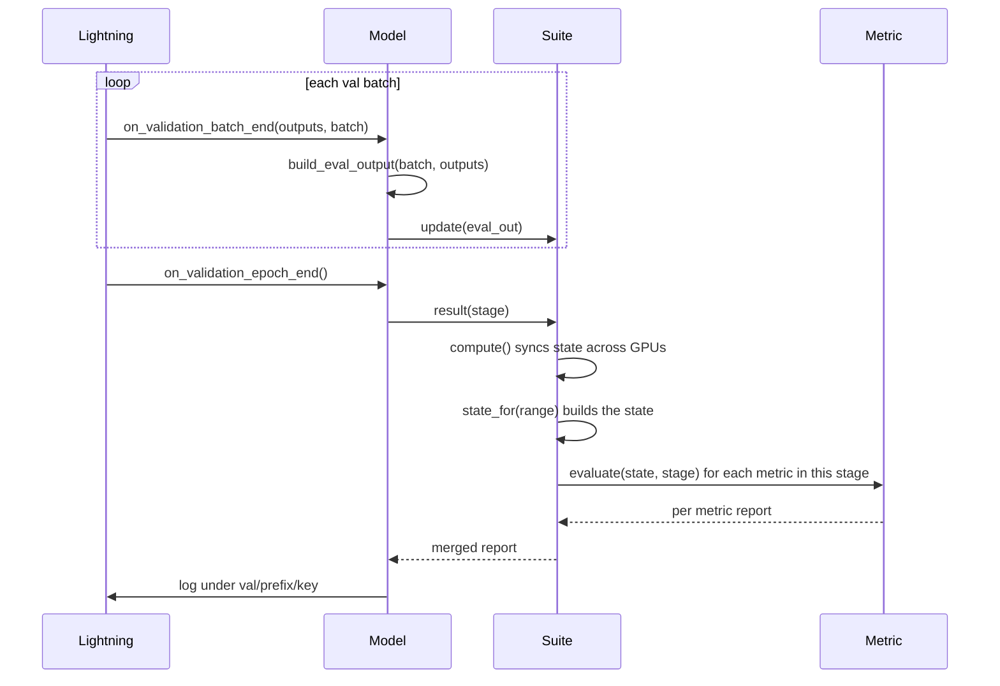
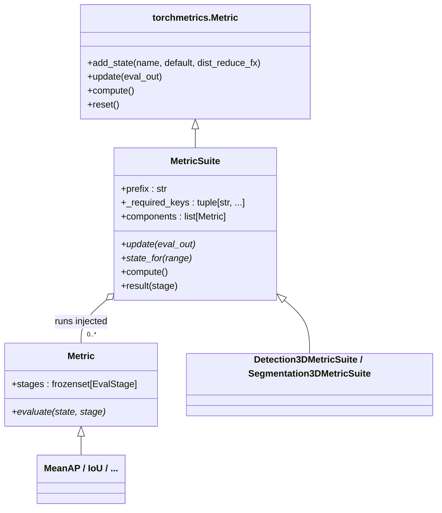

# Metrics

A metric accumulates data over an epoch and produces a scalar report at the end. Metrics are
attached to a model from config and run during validation and test. Losses are handled by the
model itself, not by metrics.

The design separates two roles:

- A **suite** (`MetricSuite`, a `torchmetrics.Metric`) is a task state-engine. It owns the
  accumulated state and its cross-GPU reduction, and the per-range dispatch. It does not decide
  which metrics run.
- A **metric** (`Metric`) is a small, self-contained, injectable object. It computes its own
  numbers from the state the suite builds, and declares which stages it runs in.

Which metrics run, and in which stages, is pure configuration. The suite is just the engine that
feeds them.

## What runs in each split

| Split   | Losses  | Metrics                                |
| ------- | ------- | -------------------------------------- |
| train   | logged  | not run                                |
| val     | logged  | run, metrics whose stages include val  |
| test    | logged  | run, metrics whose stages include test |
| predict | not run | not run                                |

Each metric declares its `stages`. The convention is that cheap headline metrics run in both val
and test, while the heavier reporting runs only in test, so validation epochs stay fast. This is
set per metric in config, not in code.

## Lifecycle

A suite runs the standard `torchmetrics` contract across an epoch.

- `update(eval_out)` runs once per batch on each GPU. It folds the batch into the suite's state
  and never talks to other GPUs.
- sync runs once at epoch end, inside `compute`. torchmetrics combines every GPU's state using
  the reduction declared for each state. This is the only cross-GPU step.
- `compute()` runs after sync. It builds a task `state` once overall and once per range, then asks
  each stage-applicable metric to `evaluate` that state and merges their reports.

`result(stage)` sets the reporting stage and calls `compute`. The mixin clones a suite per stage
and resets it at epoch start, so each instance reports for exactly one stage.



## State and reduction

Each piece of state is registered with `add_state(name, default, dist_reduce_fx)`. The reduce
function is how torchmetrics combines that state across GPUs, chosen per state by what the
quantity is.

| Suite        | State                                                  | `dist_reduce_fx` | Why                                                                                      |
| ------------ | ------------------------------------------------------ | ---------------- | ---------------------------------------------------------------------------------------- |
| segmentation | one stacked confusion tensor, shape `(ranges+1, C, C)` | `sum`            | counts are additive, so the global matrices are the per-rank ones summed                 |
| detection    | per-frame prediction and GT tensors, as list states    | `None`           | each frame stays its own list element, so matching stays within a frame after the gather |

A confusion matrix is a bounded sufficient statistic, so segmentation keeps one matrix per range
in a single stacked state and derives every metric from it. Detection mAP needs the raw per-frame
samples because matching is score-ordered and happens inside each frame, so the detection states
are kept as per-frame list elements and gathered with no reduction.

## Class structure



Method marks:

| Mark | Meaning                              |
| ---- | ------------------------------------ |
| `*`  | abstract, the subclass implements it |
| none | concrete, provided by the base       |

A suite implements `update` and `state_for` and declares `prefix` and `_required_keys`. A metric
implements `evaluate` and declares `stages`. The suite holds a list of metrics it was given and
runs each one against the state. Adding a metric means adding a `Metric` subclass and listing it
in config, never editing the suite.

## Built-in suites and metrics

| Suite                       | `prefix` | `_required_keys`                                    | Available metrics                        |
| --------------------------- | -------- | --------------------------------------------------- | ---------------------------------------- |
| `Detection3DMetricSuite`    | `det3d`  | `predictions`, `gt_boxes`, `gt_labels`              | `MeanAP`, `HeadingAP`, `Nds`, `TpErrors` |
| `Segmentation3DMetricSuite` | `seg3d`  | `seg_pred_labels`, `seg_target_labels`, `seg_coord` | `IoU`, `Accuracy`, `PrecisionRecallF1`   |

Both suites are range-aware. Configure `ranges` (radial `MetricRange` windows) and every key a
metric emits is also emitted per range with a distance suffix, for example
`test/seg3d/iou_car_0m_50m` or `test/det3d/mAP_car_50m_90m`. Detection clips boxes per range.
Segmentation keeps one confusion matrix per range and uses `seg_coord` (per-point xy) to bucket
points.

Keys are logged as `{split}/{prefix}/{key}`, for example `val/det3d/mAP`. Checkpoint monitors and
Optuna targets point at these keys directly.

## Attaching metrics

`model.metrics` is a list of suites, so a joint segmentation and detection model lists two. Each
suite is given its `components` (the metrics it runs) and the stages each one runs in. The full
suite lives once in the task base config and reads its range buckets and per-class caps from the
`metric_ranges` and `metric_eval_class_range` interpolation variables. A variant retunes the suite
by overriding just those two variables. This indirection is deliberate: `model.metrics` is a list,
and Hydra replaces a list wholesale rather than merging it, so overriding the suite directly would
mean restating every field.

```yaml
# base config: the suite defined once, reading the tunable bits from variables
metric_eval_class_range: { car: 121.0, truck: 121.0, bus: 121.0, bicycle: 121.0, pedestrian: 121.0 }
metric_ranges:
  - { _target_: autoware_ml.metrics.base.MetricRange, name: 0-50m, min_distance: 0.0, max_distance: 50.0 }
  - { _target_: autoware_ml.metrics.base.MetricRange, name: 50-90m, min_distance: 50.0, max_distance: 90.0 }

model:
  metrics:
    - _target_: autoware_ml.metrics.detection3d.suite.Detection3DMetricSuite
      class_names: ${class_names}
      eval_class_range: ${metric_eval_class_range}
      ranges: ${metric_ranges}
      components:
        - { _target_: autoware_ml.metrics.detection3d.mean_ap.MeanAP, stages: [val, test] }
        - { _target_: autoware_ml.metrics.detection3d.heading_ap.HeadingAP, stages: [test] }
        - { _target_: autoware_ml.metrics.detection3d.nds.Nds, stages: [test] }
        - { _target_: autoware_ml.metrics.detection3d.tp_errors.TpErrors, stages: [test] }

# variant: retune without restating the suite
metric_eval_class_range: { car: 102.0, pedestrian: 102.0 }  # and the rest
```

## What a model provides

One method. It maps the raw forward outputs to the flat dict the suites read. Model-specific work
like box decoding happens here.

```python
class ModelA(BaseModel):
    def build_eval_output(self, batch, outputs):
        return {
            "predictions": self.bbox_head.predict(outputs),
            "gt_boxes": batch["gt_boxes"],
            "gt_labels": batch["gt_labels"],
        }
```

The mixin feeds this dict into every attached suite. The model never calls `update`, `compute`,
or `result`.

## Writing a custom metric

A metric is the unit of extension. Subclass `Metric`, declare the stages it runs in (or accept the
default), and read the suite's state. The example adds a per-class accuracy view to segmentation
without touching the suite.

```python
class PerClassAccuracy(Metric):
    def evaluate(self, state, stage):
        return {
            f"acc_class_{i}": float(state.recall[i].item())
            for i in range(state.num_classes)
            if bool(state.has_support[i])
        }
```

Add it to the suite's `components` list in config and its keys appear under the suite prefix. A new
metric family that needs new state is a new suite, which implements `update` and `state_for`.

## Distributed runs

| Quantity | How it combines across GPUs                                                       |
| -------- | --------------------------------------------------------------------------------- |
| Loss     | Lightning reduces the scalar with `sync_dist=True`                                |
| Metric   | torchmetrics reduces each state by its `dist_reduce_fx`, then `compute` runs once |

Losses are means, so a mean across GPUs is correct. Metrics are not always linear, so each state
declares how it combines and torchmetrics applies it before computing. After sync the state is
identical on every rank, so the result is logged without `sync_dist`.

!!! note "Distributed eval padding"
    `autoware-ml test` runs on a single device by default, so there is no padding and the metrics
    are exact. Pass `--use-config-devices` to evaluate on the config's devices. The caveat below
    only applies when evaluation runs on more than one device, for example validation during
    multi-GPU training or test with `--use-config-devices` on several GPUs.

    Under DDP the validation sampler pads the last batch with repeated frames so the dataset
    divides evenly across ranks, which double counts at most `world_size - 1` frames. On a normal
    validation set this is well under a tenth of a percent and is left uncorrected. A detection
    suite could drop the duplicates by frame id, but a segmentation suite cannot, because its
    confusion matrix has already pooled the points and a single frame can no longer be removed.
    Bit exact multi-device eval would instead use a non padding sampler at the datamodule level,
    which is out of scope for the metrics.
