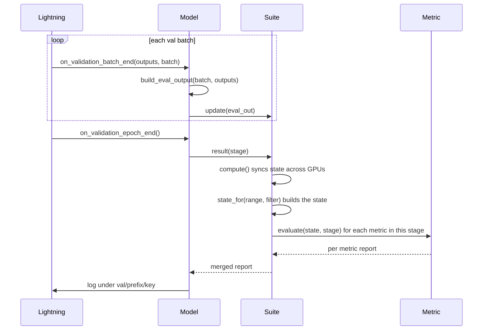
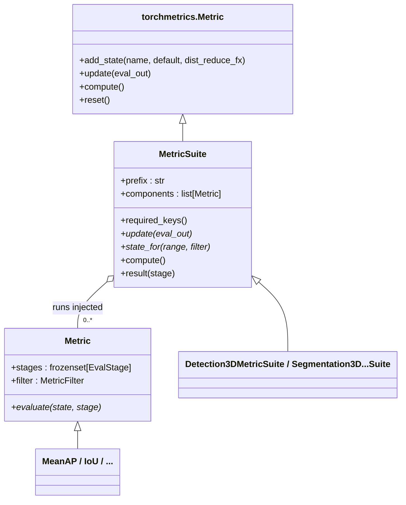

# Metrics

A metric accumulates data over an epoch and produces a scalar report at the end. Metrics are
attached to a model from config and run during validation and test. Losses are handled by the
model itself, not by metrics.

<style>
.metrics-fig {
  --ink: #1B2420; --ink2: #47524C; --muted: #68736D; --line: #DEE4DF;
  --surface: #FFFFFF; --chip-bg: #EDF1EE; --code-bg: #F0F3F0;
  --accent: #0F8A6C; --accent-text: #0A6B52; --danger: #B3261E;
  --ego: #2B5FD9; --obj: #C2410C;
  text-align: center; margin: 1rem 0; overflow-x: auto;
}
[data-md-color-scheme="slate"] .metrics-fig {
  --ink: #E4EAE5; --ink2: #A9B5AE; --muted: #7E8A83; --line: #28322C;
  --surface: #161D19; --chip-bg: #1D2621; --code-bg: #131A16;
  --accent: #2AA47B; --accent-text: #56C79C; --danger: #E5776C;
}
.metrics-fig svg { max-width: 100%; height: auto; }
.metrics-fig .svg-label { font-family: var(--md-text-font-family, system-ui), sans-serif; font-size: 12px; fill: var(--ink2); }
.metrics-fig .svg-label.small { font-size: 10.5px; fill: var(--muted); }
.metrics-fig .svg-label.strong { font-weight: 600; fill: var(--ink); }
</style>

The design separates two roles:

- A **suite** (`MetricSuite`, a `torchmetrics.Metric`) is a task state engine. It owns the
  accumulated state, its cross-GPU reduction, and the dispatch across the range and filter axes.
  It does not decide which metrics run.
- A **metric** (`Metric`) is a small, self-contained, injectable object. It computes its own
  numbers from the state the suite builds, and declares which stages it runs in and which filter
  it reads.

Which metrics run, in which stages, and over which slices is pure configuration. The suite is
just the engine that feeds them.

## What runs in each split

| Split   | Losses  | Metrics                                |
| ------- | ------- | -------------------------------------- |
| train   | logged  | not run                                |
| val     | logged  | run, metrics whose stages include val  |
| test    | logged  | run, metrics whose stages include test |
| predict | not run | not run                                |

Each metric declares its `stages`. The convention is that cheap headline metrics run in both val
and test, while the heavier reporting runs only in test, so validation epochs stay fast. A suite
is cloned only for the stages where at least one of its components reports, so a heavy test-only
suite does not exist at validation time at all.

## Lifecycle

A suite runs the standard `torchmetrics` contract across an epoch.

- `update(eval_out)` runs once per batch on each GPU. It folds the batch into the suite's state
  and never talks to other GPUs. Everything that needs per-frame context that is not a tensor,
  such as the ego pose or the scene's lanelet map, happens here.
- sync runs once at epoch end, inside `compute`. torchmetrics combines every GPU's state using
  the reduction declared for each state. This is the only cross-GPU step.
- `compute()` runs after sync. Components are grouped by their filter, the suite builds one state
  per filter and range window, and every stage-applicable metric evaluates the state its filter
  selects.

`result(stage)` sets the reporting stage and calls `compute`. The mixin clones a suite per stage
it reports at and resets it at epoch start, so each instance reports for exactly one stage. A
suite declares the eval-output keys it needs through `required_keys()`, which folds in the keys
its active components and their filters require, and the first batch fails loud when one is
missing.


```mermaid
sequenceDiagram
    participant L as Lightning
    participant M as Model
    participant S as Suite
    participant Me as Metric
    loop each val batch
        L->>M: on_validation_batch_end(outputs, batch)
        M->>M: build_eval_output(batch, outputs)
        M->>S: update(eval_out)
    end
    L->>M: on_validation_epoch_end()
    M->>S: result(stage)
    S->>S: compute() syncs state across GPUs
    S->>S: state_for(range, filter) builds the state
    S->>Me: evaluate(state, stage) for each metric in this stage
    Me-->>S: per metric report
    S-->>M: merged report
    M->>L: log under val/prefix/key
```

## Built-in suites

Each piece of state is registered with `add_state(name, default, dist_reduce_fx)`, the reduce
function torchmetrics uses to combine that state across GPUs.

| Suite                                      | `prefix`   | Required keys                          | State (`dist_reduce_fx`)                                  |
| ------------------------------------------ | ---------- | -------------------------------------- | ---------------------------------------------------------- |
| `Detection3DMetricSuite`                   | `det3d`    | `predictions`, `gt_boxes`, `gt_labels` | per-frame box tensors as list states (`None`)               |
| `Segmentation3DConfusionMatrixMetricSuite` | `seg3d`    | `seg_frames`                           | one confusion tensor over (filter, range) buckets (`sum`)   |
| `Segmentation3DPointCloudMetricSuite`      | `seg3d_pt` | `seg_frames`                           | per-frame point tensors (`None`)                            |

A confusion matrix is a bounded sufficient statistic, so its counts sum across ranks. Detection
matching is score ordered inside each frame and the point-level metrics read raw points, so those
states stay per-frame list elements gathered with no reduction. Evaluation filters need the ego
pose and the scene's lanelet map, which are not tensors, so their keep-masks are computed per
frame at `update` and stored as boolean states, and DDP gathers only tensors.

`seg_frames` is a list with one entry per frame carrying that frame's point coordinates,
predicted and target labels, per-class scores, and the per-frame metadata configured filters
need (`ego2global`, `scene_token`). `required_keys()` extends the base tuple with what the
configuration demands: a detection suite with a collision provider also requires `ego2global`
and `scene_token`, and a ground-truth point filter requires `gt_num_points`.

Keys are logged as `{split}/{prefix}/{key}`. A filtered metric prefixes its filter name and a
range window appends a distance suffix, for example `test/det3d/region_road/mAP_0m_50m`. Two
suites of the same class run side by side under distinct configured prefixes, and the mixin
rejects duplicate prefixes.

## Class structure


```mermaid
classDiagram
    class TorchMetric["torchmetrics.Metric"] {
        +add_state(name, default, dist_reduce_fx)
        +update(eval_out)
        +compute()
        +reset()
    }
    class MetricSuite {
        +prefix : str
        +components : list[Metric]
        +required_keys()
        +update(eval_out)*
        +state_for(range, filter)*
        +compute()
        +result(stage)
    }
    class Metric {
        +stages : frozenset[EvalStage]
        +filter : MetricFilter
        +evaluate(state, stage)*
    }
    class TaskSuite["Detection3DMetricSuite / Segmentation3D...Suite"]
    class TaskMetric["MeanAP / IoU / ..."]
    TorchMetric <|-- MetricSuite
    MetricSuite <|-- TaskSuite
    Metric <|-- TaskMetric
    MetricSuite o-- "0..*" Metric : runs injected
```

Method marks:

| Mark | Meaning                              |
| ---- | ------------------------------------ |
| `*`  | abstract, the subclass implements it |
| none | concrete, provided by the base       |

A suite implements `update` and `state_for` and declares its `prefix` and required keys. A metric
implements `evaluate` and declares `stages` and an optional `filter`. The suite holds a list of
metrics it was given and runs each one against the state its filter selects. Adding a metric
means adding a `Metric` subclass and listing it in config, never editing the suite.

## Data requirements

The baseline metrics need nothing beyond the model's predictions and the ground truth. Each
optional capability adds a concrete requirement, checked loud at the first batch.

| Capability                                       | Eval-output keys                       | External data              |
| ------------------------------------------------ | -------------------------------------- | -------------------------- |
| detection metrics                                | `predictions`, `gt_boxes`, `gt_labels` | none                       |
| segmentation metrics                             | `seg_frames`                           | none                       |
| ground-truth point filter, occlusion split       | `gt_num_points` (per-box point count)  | none                       |
| corridor filter (straight strip)                 | none                                   | none                       |
| region filters and collision filter              | `ego2global`, `scene_token` per frame  | one lanelet2 map per scene |
| collision metrics (critical FP/FN, weighted mAP) | `ego2global`, `scene_token` per frame  | one lanelet2 map per scene |
| velocity error (TP errors, NDS)                  | boxes with velocity components         | none                       |
| partial-detection score                          | ground-truth boxes inside `seg_frames` | none                       |

The map-based features never read a map path directly. They pass the frame's `scene_token` to a
map provider, and an injected resolver turns that identifier into the scene's `lanelet2_map.osm`.
Any data source that can name a map file per scene and attach a per-frame ego pose in the map
frame can use them.

A missing eval-output key fails loud at the first batch, naming the suite and the key. A missing
map is the one tolerated absence: the scene is excluded from the map-based slices and the
collision metrics, kept in the whole-scene and corridor metrics, and the per-filter coverage is
logged every epoch (see Coverage below). Boxes without velocity components score the worst-case
velocity error instead of failing.

## Evaluation axes

Every metric can be reported over orthogonal, purely configurational axes.

**Ranges.** Radial distance windows. Every key a metric emits is also emitted per range with a
distance suffix. Detection clips boxes per range, segmentation buckets points.

<div class="metrics-fig">
<svg viewBox="0 0 660 240" width="660" height="240" role="img" aria-labelledby="fig-range-title">
  <title id="fig-range-title">Concentric radial distance bins around ego. Every object or point falls into the bin of its distance from ego, and every metric key is emitted once per bin in addition to the unbinned value.</title>
  <rect x="8" y="8" width="644" height="224" rx="10" fill="var(--surface)" stroke="var(--line)"/>
  <text x="330" y="32" class="svg-label strong" text-anchor="middle">Radial range bins around ego</text>
  <text x="330" y="52" class="svg-label small" text-anchor="middle">every reported key is emitted once more per bin, with a distance suffix</text>
  <line x1="60" y1="200" x2="600" y2="200" stroke="var(--line)"/>
  <path d="M 275 200 A 55 55 0 0 1 385 200" fill="none" stroke="var(--muted)" stroke-dasharray="4 4"/>
  <path d="M 231 200 A 99 99 0 0 1 429 200" fill="none" stroke="var(--muted)" stroke-dasharray="4 4"/>
  <path d="M 198 200 A 132 132 0 0 1 462 200" fill="none" stroke="var(--muted)" stroke-dasharray="4 4"/>
  <rect x="308" y="186" width="44" height="28" rx="4" fill="var(--ego)"/>
  <text x="288" y="226" class="svg-label small" text-anchor="middle">ego</text>
  <text x="330" y="166" class="svg-label small" text-anchor="middle">0-50 m</text>
  <text x="330" y="126" class="svg-label small" text-anchor="middle">50-90 m</text>
  <text x="330" y="88" class="svg-label small" text-anchor="middle">90-120 m</text>
  <rect x="336" y="169" width="24" height="14" rx="3" fill="none" stroke="var(--ink2)" stroke-width="2" stroke-dasharray="7 5"/>
  <rect x="380" y="147" width="24" height="14" rx="3" fill="none" stroke="var(--ink2)" stroke-width="2" stroke-dasharray="7 5"/>
  <rect x="426" y="153" width="24" height="14" rx="3" fill="none" stroke="var(--ink2)" stroke-width="2" stroke-dasharray="7 5"/>
</svg>
</div>

**Region filter.** `RegionFilter` keeps only the elements whose position, transformed to the map
frame by the frame's ego pose, falls inside a chosen set of lanelet regions. Detection tests the
whole box footprint, segmentation tests each point. Any metric combined with a region filter
becomes its on-road or on-walkway variant.

<div class="metrics-fig">
<svg viewBox="0 0 660 230" width="660" height="230" role="img" aria-labelledby="fig-region-title">
      <title id="fig-region-title">Bird's-eye view of the lanelet regions: a road band (including a crosswalk stripe, where the car drives) and a separate walkway band; objects are assigned to road, walkway, or neither, and metrics run per region. A car whose center is off the road but whose footprint overhangs it is still included, because membership is any footprint overlap (no threshold), not the center.</title>
      <rect x="10" y="96" width="640" height="70" rx="6" fill="var(--ego)" opacity="0.14"/>
      <line x1="10" y1="131" x2="650" y2="131" stroke="var(--muted)" stroke-width="1.5" stroke-dasharray="14 12" opacity="0.5"/>
      <text x="24" y="120" class="svg-label small" fill="var(--ego)">road (drivable lanelet primitives)</text>
      <rect x="418" y="96" width="30" height="70" fill="var(--ego)" opacity="0.22"/>
      <text x="433" y="90" class="svg-label small" fill="var(--ego)" text-anchor="middle">crosswalk</text>
      <rect x="10" y="60" width="640" height="26" rx="5" fill="var(--accent)" opacity="0.16"/>
      <text x="24" y="52" class="svg-label small" fill="var(--accent-text)">walkway (pedestrian-only)</text>
      <rect x="40" y="128" width="44" height="24" rx="4" fill="var(--ego)"/>
      <text x="62" y="182" class="svg-label small" text-anchor="middle">ego</text>
      <rect x="220" y="112" width="40" height="22" rx="3" fill="var(--obj)"/>
      <rect x="330" y="134" width="40" height="22" rx="3" fill="var(--obj)"/>
      <text x="290" y="182" class="svg-label small" text-anchor="middle">road slice</text>
      <circle cx="520" cy="73" r="8" fill="var(--obj)"/>
      <text x="520" y="52" class="svg-label small" text-anchor="middle">walkway slice</text>
      <rect x="560" y="14" width="40" height="18" rx="3" fill="var(--muted)" opacity="0.5"/>
      <text x="548" y="27" class="svg-label small" text-anchor="end">off-map -> whole-scene only</text>
      <!-- car with its center off the road but its footprint overhanging onto it -> included (any overlap) -->
      <rect x="452" y="159" width="52" height="28" rx="3" fill="var(--obj)" opacity="0.9" stroke="var(--ego)" stroke-width="2"/>
      <line x1="444" y1="166" x2="512" y2="166" stroke="var(--ego)" stroke-width="1.5" stroke-dasharray="4 3"/>
      <circle cx="478" cy="173" r="3" fill="var(--danger)"/>
      <text x="478" y="152" class="svg-label strong" fill="var(--obj)" text-anchor="middle">overhangs road -> included</text>
      <text x="478" y="207" class="svg-label small" fill="var(--muted)" text-anchor="middle">● center off-road</text>
    </svg>
</div>

An optional margin erodes the outer border of the union of the mapped regions, so noisy points at
the edge of the mapped surface stop counting in the filtered slice.

<div class="metrics-fig">
<svg viewBox="0 0 660 250" width="660" height="250" role="img" aria-labelledby="fig-margin-title">
      <title id="fig-margin-title">The border margin erodes only the outer border of the union of all mapped regions: strips along the top of the walkway and the bottom of the road are excluded, while the internal road-to-walkway border keeps its points on both sides - no dead gap between adjacent regions.</title>
      <!-- walkway band -->
      <rect x="10" y="50" width="640" height="42" fill="var(--accent)" opacity="0.16"/>
      <text x="24" y="78" class="svg-label small" fill="var(--accent-text)">walkway</text>
      <!-- road band, adjacent below -->
      <rect x="10" y="92" width="640" height="98" fill="var(--ego)" opacity="0.14"/>
      <text x="24" y="150" class="svg-label small" fill="var(--ego)">road</text>
      <!-- eroded strips along the OUTER border of the union -->
      <rect x="10" y="50" width="640" height="12" fill="var(--danger)" opacity="0.14"/>
      <rect x="10" y="178" width="640" height="12" fill="var(--danger)" opacity="0.14"/>
      <line x1="10" y1="62" x2="650" y2="62" stroke="var(--danger)" stroke-width="1.5" stroke-dasharray="5 4"/>
      <line x1="10" y1="178" x2="650" y2="178" stroke="var(--danger)" stroke-width="1.5" stroke-dasharray="5 4"/>
      <text x="340" y="174" class="svg-label small" fill="var(--danger)" text-anchor="middle">outer border ⊖ margin (negative margin) -> excluded</text>
      <!-- internal border: intact -->
      <line x1="10" y1="92" x2="650" y2="92" stroke="var(--ink2)" stroke-width="1.5"/>
      <text x="340" y="110" class="svg-label small" text-anchor="middle">internal border (road <-> walkway) - not eroded, no gap</text>
      <!-- margin dimension bracket -->
      <path d="M 626 178 L 634 178 L 634 190 L 626 190" fill="none" stroke="var(--danger)" stroke-width="1.5"/>
      <text x="620" y="188" class="svg-label small" fill="var(--danger)" text-anchor="end">margin</text>
      <!-- points: kept near the internal border, both sides -->
      <circle cx="460" cy="87" r="5" fill="var(--obj)"/>
      <circle cx="460" cy="98" r="5" fill="var(--obj)"/>
      <text x="472" y="90" class="svg-label small">kept - both sides</text>
      <!-- points: dropped inside the eroded strips -->
      <circle cx="150" cy="56" r="5" fill="var(--obj)" opacity="0.4"/>
      <text x="162" y="60" class="svg-label small" fill="var(--muted)">dropped</text>
      <circle cx="150" cy="184" r="5" fill="var(--obj)" opacity="0.4"/>
      <text x="162" y="188" class="svg-label small" fill="var(--muted)">dropped</text>
      <!-- kept point well inside the road -->
      <circle cx="150" cy="135" r="5" fill="var(--obj)"/>
      <text x="162" y="139" class="svg-label small">kept</text>
      <text x="330" y="236" class="svg-label small" text-anchor="middle">erosion applies to the union of ALL regions - never per region</text>
    </svg>
</div>

**Corridor filter.** `CorridorFilter` keeps only the elements inside a straight corridor ahead of
ego: a fixed-width forward strip in the ego frame. The strip carries no length bound of its own,
because every key is range-binned anyway, so the range axis already slices the corridor by
distance. It needs no map and no pose, so the slice covers every scene. A detection box counts
when any part of its footprint overlaps the strip.

<div class="metrics-fig">
<svg viewBox="0 0 660 200" width="660" height="200" role="img" aria-labelledby="fig-strip-title">
  <title id="fig-strip-title">Bird's-eye view of the straight corridor: a fixed-width forward strip ahead of ego with no length bound. An object inside or overlapping the strip is kept, an object beside or behind it is dropped.</title>
  <rect x="8" y="8" width="644" height="184" rx="10" fill="var(--surface)" stroke="var(--line)"/>
  <text x="330" y="32" class="svg-label strong" text-anchor="middle">A fixed-width strip ahead of ego, no map involved</text>
  <rect x="96" y="86" width="548" height="44" fill="var(--ego)" opacity="0.14"/>
  <line x1="96" y1="86" x2="644" y2="86" stroke="var(--ego)" stroke-dasharray="5 4" opacity="0.7"/>
  <line x1="96" y1="130" x2="644" y2="130" stroke="var(--ego)" stroke-dasharray="5 4" opacity="0.7"/>
  <line x1="96" y1="86" x2="96" y2="130" stroke="var(--ego)" stroke-dasharray="5 4" opacity="0.7"/>
  <polygon points="628,101 646,108 628,115" fill="var(--ego)" opacity="0.5"/>
  <rect x="46" y="94" width="50" height="28" rx="4" fill="var(--ego)"/>
  <text x="71" y="140" class="svg-label small" text-anchor="middle">ego</text>
  <text x="330" y="166" class="svg-label small" text-anchor="middle">no length bound, distance is sliced by the range bins</text>
  <line x1="560" y1="86" x2="560" y2="130" stroke="var(--muted)" stroke-width="1" opacity="0.6"/>
  <text x="560" y="78" class="svg-label small" text-anchor="middle">width</text>
  <rect x="250" y="98" width="40" height="20" rx="3" fill="var(--obj)"/>
  <text x="270" y="80" class="svg-label small" fill="var(--obj)" text-anchor="middle">inside -&gt; kept</text>
  <rect x="380" y="120" width="40" height="20" rx="3" fill="var(--obj)"/>
  <text x="400" y="52" class="svg-label small" fill="var(--obj)" text-anchor="middle">overlaps -&gt; kept</text>
  <line x1="400" y1="58" x2="400" y2="116" stroke="var(--muted)" stroke-width="1" opacity="0.5"/>
  <rect x="250" y="44" width="40" height="20" rx="3" fill="var(--obj)" opacity="0.5"/>
  <text x="170" y="58" class="svg-label small" fill="var(--muted)" text-anchor="middle">beside -&gt; dropped</text>
</svg>
</div>

**Collision filter.** `CollisionFilter` keeps only the elements inside the ego collision area,
everything ego could collide with within the horizon under bounded steering, clipped to the
drivable lanelets so it follows the road on bends. It is a reporting slice like the region
filter, computed per frame from the same collision model the collision metrics use.

<div class="metrics-fig">
<svg viewBox="0 0 660 220" width="660" height="220" role="img" aria-labelledby="fig-collision-title">
      <title id="fig-collision-title">Bird's-eye view: the collision area is everything ego could collide with within the horizon at the lane speed limit under bounded steering, hard-clipped to the road; an object inside is kept, one off the road or beyond the horizon is dropped.</title>
      <defs><clipPath id="collision-clip"><rect x="8" y="70" width="644" height="84"/></clipPath></defs>
      <rect x="8" y="34" width="644" height="36" fill="var(--chip-bg)" opacity="0.55"/>
      <text x="16" y="28" class="svg-label small">sidewalk</text>
      <rect x="8" y="70" width="644" height="84" rx="6" fill="var(--chip-bg)"/>
      <text x="644" y="148" class="svg-label small" text-anchor="end">road (drivable)</text>
      <!-- collision area drawn extending off-road, then hard-clipped to the road -->
      <g clip-path="url(#collision-clip)">
        <path d="M 86 102 C 146 102 196 62 206 6 C 306 26 358 76 358 112 C 358 148 306 198 206 218 C 196 162 146 122 86 122 Z" fill="var(--ego)" opacity="0.16"/>
        <path d="M 86 102 C 146 102 196 62 206 6" fill="none" stroke="var(--ego)" stroke-width="1.8" opacity="0.75"/>
        <path d="M 86 122 C 146 122 196 162 206 218" fill="none" stroke="var(--ego)" stroke-width="1.8" opacity="0.75"/>
        <path d="M 206 6 C 306 26 358 76 358 112 C 358 148 306 198 206 218" fill="none" stroke="var(--ego)" stroke-width="1.8" stroke-dasharray="6 5" opacity="0.75"/>
      </g>
      <rect x="40" y="100" width="46" height="24" rx="4" fill="var(--ego)"/>
      <text x="63" y="94" class="svg-label strong" text-anchor="middle">ego</text>
      <!-- object inside the region -->
      <rect x="268" y="102" width="40" height="20" rx="3" fill="var(--obj)"/>
      <text x="288" y="96" class="svg-label strong" fill="var(--obj)" text-anchor="middle">in path -> kept</text>
      <!-- object on the sidewalk (region is clipped there) -->
      <rect x="268" y="42" width="40" height="20" rx="3" fill="var(--obj)" opacity="0.5"/>
      <text x="366" y="56" class="svg-label small" fill="var(--muted)">off road -> dropped</text>
      <!-- object beyond the horizon reach -->
      <rect x="560" y="102" width="40" height="20" rx="3" fill="var(--obj)" opacity="0.5"/>
      <text x="580" y="172" class="svg-label small" fill="var(--muted)" text-anchor="middle">beyond the horizon -> dropped</text>
      <text x="150" y="206" class="svg-label small">lane speed limit + tightest feasible turn, clipped at the road edge</text>
    </svg>
</div>

**Behaviour groups.** `class_groups` folds the trained classes onto behaviour-equivalent groups.
Confusing a bus for a truck does not change how the vehicle drives, so inside a group it counts
as a hit. Grouping always replaces the class axis, never extends it: the same suite is configured
twice, once per class and once grouped under its own prefix, and both views share one
accumulation contract.

**Coverage.** A scene without a lanelet map cannot be map-filtered, so region and collision
slices exclude its frames while the whole-scene and corridor metrics keep them. The suites count
per-filter frame coverage and log it every epoch, so a slice computed over fewer scenes is never
silent.

### The collision model

The collision model is not a filter but mechanics. It extends the collision filter: the same
region construction (one shared ego agent, the same clipped area) with a time rule applied on
top. Configured on the suite as the `CollisionTTC` provider, it computes a time to collision
(TTC) per detection box once per frame at update time, from the ego pose, the class-specific
collision sets, and the scene's lanelet map. The metrics that declare `needs_ttc` read the
stored TTC at compute time.

The model answers a perception question: if ego never sees this object, what is the worst that
can follow? Ego and every object therefore move at their class maximum speed under the tightest
feasible turn, forward or in reverse, whichever closes the gap, so the collision set is a
worst-case bound and never a trajectory prediction. Matched-speed traffic is not exempt, a lead
that brakes hard is exactly the case a missed detection has to cover. A wheeled agent sweeps its
body rectangle along the arc, so a long vehicle reaches beyond its reference point, and the
sweep is clipped to the drivable area with only the part still connected to the driven path
kept.

<div class="metrics-fig">
<svg viewBox="0 0 700 300" width="700" height="300" role="img" aria-labelledby="fig-reach-title">
      <title id="fig-reach-title">Bird's-eye worst-case collision model: ego expands to everything its body can sweep at maximum speed under its tightest feasible left/right turn - constant-curvature arcs that keep their curvature right up to the road edge, where the drivable area hard-clips them with a sharp corner. Only the forward half is drawn, reverse travel mirrors it behind ego. A crossing pedestrian expands an isotropic disc; a stationary barrier stays put. TTC is the first time a set meets ego's region.</title>
      <defs><clipPath id="road-clip"><rect x="0" y="92" width="700" height="150"/></clipPath></defs>
      <rect x="0" y="46" width="700" height="46" fill="var(--chip-bg)" opacity="0.55"/>
      <text x="34" y="40" class="svg-label small">sidewalk</text>
      <rect x="0" y="92" width="700" height="150" fill="var(--chip-bg)" rx="4"/>
      <text x="612" y="234" class="svg-label small" text-anchor="end">road (drivable)</text>
      <!-- collision area + its arcs are drawn extending off-road, then hard-clipped to the road -->
      <g clip-path="url(#road-clip)">
        <path d="M 90 156 C 150 156 200 108 210 44 C 316 66 372 116 372 167 C 372 218 316 268 210 290 C 200 226 150 178 90 178 Z" fill="var(--ego)" opacity="0.16"/>
        <path d="M 90 156 C 150 156 200 108 210 44" fill="none" stroke="var(--ego)" stroke-width="1.8" opacity="0.75"/>
        <path d="M 90 178 C 150 178 200 226 210 290" fill="none" stroke="var(--ego)" stroke-width="1.8" opacity="0.75"/>
        <path d="M 210 44 C 316 66 372 116 372 167 C 372 218 316 268 210 290" fill="none" stroke="var(--ego)" stroke-width="1.8" stroke-dasharray="6 5" opacity="0.75"/>
        <path d="M 90 167 L 372 167" fill="none" stroke="var(--ego)" stroke-width="1" opacity="0.3" stroke-dasharray="4 4"/>
        <path d="M 90 167 Q 235 150 322 112" fill="none" stroke="var(--ego)" stroke-width="1" opacity="0.3"/>
        <path d="M 90 167 Q 235 184 322 222" fill="none" stroke="var(--ego)" stroke-width="1" opacity="0.3"/>
      </g>
      <!-- time ticks along the straight centerline -->
      <circle cx="160" cy="167" r="2.5" fill="var(--ego)"/><text x="160" y="182" class="svg-label small" text-anchor="middle">1</text>
      <circle cx="231" cy="167" r="2.5" fill="var(--ego)"/><text x="231" y="182" class="svg-label small" text-anchor="middle">2</text>
      <circle cx="301" cy="167" r="2.5" fill="var(--ego)"/><text x="301" y="182" class="svg-label small" text-anchor="middle">3 s</text>
      <rect x="44" y="154" width="46" height="26" rx="4" fill="var(--ego)"/>
      <text x="67" y="148" class="svg-label strong" text-anchor="middle">ego</text>
      <text x="150" y="284" class="svg-label small">worst case: max speed + tightest turn, hard-clipped at the road edge (reverse is the mirror image)</text>
      <!-- crossing pedestrian + isotropic disc -->
      <circle cx="235" cy="62" r="48" fill="var(--obj)" opacity="0.08"/>
      <circle cx="235" cy="62" r="48" fill="none" stroke="var(--obj)" stroke-width="1.5" stroke-dasharray="5 5" opacity="0.6"/>
      <circle cx="235" cy="62" r="7" fill="var(--obj)"/>
      <text x="150" y="30" class="svg-label small">pedestrian * disc</text>
      <circle cx="235" cy="99" r="9" fill="none" stroke="var(--danger)" stroke-width="2.5"/>
      <circle cx="235" cy="99" r="2.5" fill="var(--danger)"/>
      <text x="486" y="118" class="svg-label strong" text-anchor="middle">set ∩ ego region -> finite TTC</text>
      <!-- stationary barrier inside the region -->
      <rect x="330" y="160" width="13" height="22" rx="2" fill="var(--muted)"/>
      <text x="336" y="155" class="svg-label small" text-anchor="middle">barrier</text>
      <circle cx="336" cy="170" r="9" fill="none" stroke="var(--danger)" stroke-width="2.5"/>
      <circle cx="336" cy="170" r="2.5" fill="var(--danger)"/>
    </svg>
</div>

The time to collision (TTC) of an object is the first time step at which its collision set and
ego's overlap. An object that cannot reach ego within the horizon has an infinite TTC.

<div class="metrics-fig">
<svg viewBox="0 0 700 210" width="700" height="210" role="img" aria-labelledby="fig-lead-title">
      <title id="fig-lead-title">A lead vehicle at the same speed: ego and the lead both advance to the right by the same amount over two seconds, so the gap between them never closes and the collision sets never overlap - time-to-collision is infinite.</title>
      <rect x="0" y="66" width="700" height="96" fill="var(--chip-bg)" rx="4"/>
      <line x1="0" y1="114" x2="700" y2="114" stroke="var(--muted)" stroke-width="1.5" stroke-dasharray="14 12" opacity="0.4"/>
      <!-- t=now: ego + lead -->
      <rect x="52" y="120" width="46" height="24" rx="4" fill="var(--ego)"/>
      <text x="75" y="160" class="svg-label small" text-anchor="middle">ego (t)</text>
      <rect x="300" y="121" width="42" height="22" rx="4" fill="var(--obj)"/>
      <text x="321" y="160" class="svg-label small" text-anchor="middle">lead (t)</text>
      <!-- t+2: ghosts, shifted right by the same amount -->
      <rect x="252" y="120" width="46" height="24" rx="4" fill="var(--ego)" opacity="0.28"/>
      <text x="275" y="94" class="svg-label small" text-anchor="middle" opacity="0.75">ego (t+2)</text>
      <rect x="500" y="121" width="42" height="22" rx="4" fill="var(--obj)" opacity="0.28"/>
      <text x="521" y="94" class="svg-label small" text-anchor="middle" opacity="0.75">lead (t+2)</text>
      <!-- equal shift arrows -->
      <path d="M 104 132 L 246 132" stroke="var(--ego)" stroke-width="1.6" stroke-dasharray="5 4"/>
      <path d="M 238 127 L 248 132 L 238 137" fill="none" stroke="var(--ego)" stroke-width="1.6"/>
      <path d="M 348 132 L 494 132" stroke="var(--obj)" stroke-width="1.6" stroke-dasharray="5 4"/>
      <path d="M 486 127 L 496 132 L 486 137" fill="none" stroke="var(--obj)" stroke-width="1.6"/>
      <!-- equal gaps -->
      <text x="199" y="184" class="svg-label small" text-anchor="middle">gap</text>
      <text x="399" y="184" class="svg-label small" text-anchor="middle">gap (unchanged)</text>
      <line x1="98" y1="176" x2="300" y2="176" stroke="var(--muted)" stroke-width="1" opacity="0.5"/>
      <line x1="298" y1="176" x2="500" y2="176" stroke="var(--muted)" stroke-width="1" opacity="0.5"/>
      <text x="350" y="40" class="svg-label strong" text-anchor="middle">same speed -> gap never closes -> TTC = inf (weight ~ 0)</text>
    </svg>
</div>

The model runs on the following constants. Values marked config are set in the bundled dataset
configs and tunable there, the rest are code defaults.

| Constant                               | Value                                              |
| -------------------------------------- | -------------------------------------------------- |
| horizon                                | 4 s (config)                                       |
| propagation time step                  | 0.1 s (config)                                     |
| max lateral acceleration (turn bound)  | 3.0 m/s^2 (config)                                 |
| minimum turn radius floor              | 3.0 m                                              |
| arc samples per reachable set          | 21                                                 |
| ego body (assumed)                     | 4.9 m long, 2.0 m wide                             |
| object body                            | the object's own box length and width               |
| wheeled speed on the map               | the lanelet speed limit at the agent's position    |
| off-map fallback speed                 | 16.7 m/s (config)                                  |
| living run speeds                      | pedestrian 3.0, animal 4.0, bicycle 6.0 m/s        |
| wheeled classes                        | car, truck, bus, train, motorcycle                 |
| living classes                         | pedestrian, animal, bicycle                        |
| static classes (footprint only)        | barrier, traffic_cone, debris, bicycle_rack, vehicle_extension |
| corridor width                         | 3.0 m (config)                                     |

### Default slices

The bundled dataset configs attach every metric to every filter slice (whole scene, road,
walkway, corridor, collision area). Every key is also emitted per radial range bin and once more
per behaviour group through the grouped twin suite. This is a profiling starting point, drop the
combinations that do not earn their compute in your project. The road slice unions the lanelet
primitives road, road_shoulder, crosswalk, drivable_area, intersection_area, and
crosswalk_polygon. The partial-detection score is wired in the joint detection plus segmentation
configs only (the detection ground truth rides in seg_frames) and is never grouped, its box to
class mapping is bound to the trained label space.

## Detection metrics

The detection state matches predictions to ground truth greedily in score order, center distance
by default with a corner-distance cost selectable per suite. Matching is memoized per class and
threshold, so every component reads the same match curves.

### Mean AP

`MeanAP` is the center-distance average precision over its match thresholds, reported
per class and as the class mean. It is the headline metric that also runs at validation. At test
it adds per-class ground-truth counts, match counts, the maximum F1, and the optimal-confidence
operating point of each curve.

<div class="metrics-fig">
<svg viewBox="0 0 660 230" width="660" height="230" role="img" aria-labelledby="fig-map-title">
  <title id="fig-map-title">Bird's-eye matching scene. A prediction whose center lies inside the ground-truth distance threshold is a true positive, a lone prediction is a false positive, and an unmatched ground-truth box is a false negative.</title>
  <rect x="8" y="8" width="644" height="214" rx="10" fill="var(--surface)" stroke="var(--line)"/>
  <text x="330" y="32" class="svg-label strong" text-anchor="middle">Greedy center-distance matching in score order</text>
  <text x="150" y="60" class="svg-label small" text-anchor="middle">distance threshold</text>
  <circle cx="150" cy="122" r="52" fill="none" stroke="var(--accent)" stroke-dasharray="4 4"/>
  <rect x="116" y="102" width="68" height="40" rx="3" fill="none" stroke="var(--ink2)" stroke-width="2" stroke-dasharray="7 5"/>
  <rect x="132" y="114" width="68" height="40" rx="3" fill="var(--obj)" opacity="0.13"/>
  <rect x="132" y="114" width="68" height="40" rx="3" fill="none" stroke="var(--obj)" stroke-width="2"/>
  <circle cx="150" cy="122" r="3" fill="var(--ink2)"/>
  <circle cx="166" cy="134" r="3" fill="var(--obj)"/>
  <line x1="150" y1="122" x2="166" y2="134" stroke="var(--accent)" stroke-width="2.5"/>
  <text x="208" y="130" class="svg-label small" fill="var(--obj)">score 0.92</text>
  <text x="150" y="190" class="svg-label small" fill="var(--accent-text)" text-anchor="middle">inside threshold -&gt; TP</text>
  <rect x="326" y="102" width="68" height="40" rx="3" fill="var(--obj)" opacity="0.13"/>
  <rect x="326" y="102" width="68" height="40" rx="3" fill="none" stroke="var(--obj)" stroke-width="2"/>
  <text x="360" y="94" class="svg-label small" fill="var(--obj)" text-anchor="middle">score 0.71</text>
  <text x="360" y="190" class="svg-label small" fill="var(--danger)" text-anchor="middle">no ground truth near -&gt; FP</text>
  <rect x="516" y="102" width="68" height="40" rx="3" fill="none" stroke="var(--ink2)" stroke-width="2" stroke-dasharray="7 5"/>
  <text x="550" y="190" class="svg-label small" text-anchor="middle">no prediction -&gt; FN</text>
  <text x="330" y="208" class="svg-label small" text-anchor="middle">Predictions claim the nearest unclaimed ground truth, AP integrates the resulting precision-recall curve.</text>
</svg>
</div>

### Heading AP

`HeadingAP` weights every true positive by its heading score, so a detector that finds objects
but points them the wrong way scores lower than plain AP.

<div class="metrics-fig">
<svg viewBox="0 0 660 220" width="660" height="220" role="img" aria-labelledby="fig-aph-title">
  <title id="fig-aph-title">Two matched pairs with the same footprint overlap. The left prediction points with the ground truth and keeps full credit, the right prediction is rotated ninety degrees and keeps half credit.</title>
  <rect x="8" y="8" width="305" height="204" rx="10" fill="var(--surface)" stroke="var(--line)"/>
  <rect x="347" y="8" width="305" height="204" rx="10" fill="var(--surface)" stroke="var(--line)"/>
  <text x="160" y="32" class="svg-label strong" text-anchor="middle">yaw error 0 -&gt; weight 1.0</text>
  <text x="499" y="32" class="svg-label strong" text-anchor="middle">yaw error 90 deg -&gt; weight 0.5</text>
  <rect x="100" y="90" width="120" height="52" rx="3" fill="none" stroke="var(--ink2)" stroke-width="2" stroke-dasharray="7 5"/>
  <rect x="104" y="94" width="112" height="44" rx="3" fill="var(--obj)" opacity="0.13"/>
  <rect x="104" y="94" width="112" height="44" rx="3" fill="none" stroke="var(--obj)" stroke-width="2"/>
  <line x1="160" y1="104" x2="228" y2="104" stroke="var(--ink2)" stroke-width="2"/>
  <polygon points="228,99 240,104 228,109" fill="var(--ink2)"/>
  <line x1="160" y1="122" x2="235" y2="122" stroke="var(--obj)" stroke-width="2.5"/>
  <polygon points="235,116 249,122 235,128" fill="var(--obj)"/>
  <text x="160" y="204" class="svg-label small" text-anchor="middle">prediction heading matches ground truth</text>
  <rect x="439" y="90" width="120" height="52" rx="3" fill="none" stroke="var(--ink2)" stroke-width="2" stroke-dasharray="7 5"/>
  <g transform="translate(499 116) rotate(90)">
    <rect x="-56" y="-22" width="112" height="44" rx="3" fill="var(--obj)" opacity="0.13"/>
    <rect x="-56" y="-22" width="112" height="44" rx="3" fill="none" stroke="var(--obj)" stroke-width="2"/>
  </g>
  <line x1="499" y1="116" x2="567" y2="116" stroke="var(--ink2)" stroke-width="2"/>
  <polygon points="567,111 579,116 567,121" fill="var(--ink2)"/>
  <line x1="499" y1="116" x2="499" y2="176" stroke="var(--obj)" stroke-width="2.5"/>
  <polygon points="493,176 499,190 505,176" fill="var(--obj)"/>
  <text x="499" y="204" class="svg-label small" text-anchor="middle">prediction heading off by 90 deg</text>
</svg>
</div>

### NDS

`Nds` folds the mean AP and the true-positive errors, taken at a single configured operating
threshold, into one composite detection score.

<div class="metrics-fig">
<svg viewBox="0 0 660 180" width="660" height="180" role="img" aria-labelledby="fig-nds-title">
  <title id="fig-nds-title">Block diagram of the composite score. The mean AP contributes half of the score and the complement of the mean true-positive errors contributes the other half.</title>
  <rect x="8" y="8" width="644" height="164" rx="10" fill="var(--surface)" stroke="var(--line)"/>
  <text x="330" y="34" class="svg-label strong" text-anchor="middle">Half detection quality, half true-positive quality</text>
  <rect x="40" y="62" width="170" height="60" rx="8" fill="var(--accent)" opacity="0.14"/>
  <rect x="40" y="62" width="170" height="60" rx="8" fill="none" stroke="var(--accent)"/>
  <text x="125" y="88" class="svg-label strong" text-anchor="middle">mean AP</text>
  <text x="125" y="108" class="svg-label small" text-anchor="middle">weight 5</text>
  <text x="235" y="98" class="svg-label strong" text-anchor="middle">+</text>
  <rect x="260" y="62" width="256" height="60" rx="8" fill="var(--chip-bg)" stroke="var(--line)"/>
  <text x="388" y="80" class="svg-label small" text-anchor="middle">1 - mean TP error, weight 5</text>
  <rect x="272" y="90" width="52" height="22" rx="5" fill="var(--surface)" stroke="var(--line)"/>
  <text x="298" y="105" class="svg-label small" text-anchor="middle">ATE</text>
  <rect x="332" y="90" width="52" height="22" rx="5" fill="var(--surface)" stroke="var(--line)"/>
  <text x="358" y="105" class="svg-label small" text-anchor="middle">AOE</text>
  <rect x="392" y="90" width="52" height="22" rx="5" fill="var(--surface)" stroke="var(--line)"/>
  <text x="418" y="105" class="svg-label small" text-anchor="middle">ASE</text>
  <rect x="452" y="90" width="52" height="22" rx="5" fill="var(--surface)" stroke="var(--line)"/>
  <text x="478" y="105" class="svg-label small" text-anchor="middle">AVE</text>
  <line x1="526" y1="92" x2="560" y2="92" stroke="var(--ink2)" stroke-width="2"/>
  <polygon points="560,87 572,92 560,97" fill="var(--ink2)"/>
  <rect x="578" y="62" width="64" height="60" rx="8" fill="var(--ego)" opacity="0.14"/>
  <rect x="578" y="62" width="64" height="60" rx="8" fill="none" stroke="var(--ego)"/>
  <text x="610" y="97" class="svg-label strong" text-anchor="middle">NDS</text>
  <text x="330" y="152" class="svg-label small" text-anchor="middle">The errors are read at one configured operating threshold, then the sum is scaled to the 0 to 1 range.</text>
</svg>
</div>

### TP errors

`TpErrors` reports the translation, orientation, scale, and velocity errors of true positives at
configured recall operating points, plus the optimal-confidence operating point.

<div class="metrics-fig">
<svg viewBox="0 0 660 240" width="660" height="240" role="img" aria-labelledby="fig-tperr-title">
  <title id="fig-tperr-title">One matched pair annotated with the four true-positive errors: the center offset, the yaw gap, the size mismatch, and the velocity gap between the two heading arrows.</title>
  <rect x="8" y="8" width="644" height="224" rx="10" fill="var(--surface)" stroke="var(--line)"/>
  <g transform="translate(200 130)">
    <rect x="-130" y="-46" width="260" height="92" rx="4" fill="none" stroke="var(--ink2)" stroke-width="2" stroke-dasharray="7 5"/>
    <g transform="translate(18 12) rotate(9)">
      <rect x="-112" y="-36" width="224" height="72" rx="4" fill="var(--obj)" opacity="0.13"/>
      <rect x="-112" y="-36" width="224" height="72" rx="4" fill="none" stroke="var(--obj)" stroke-width="2"/>
    </g>
    <circle cx="0" cy="0" r="3.5" fill="var(--ink2)"/>
    <circle cx="18" cy="12" r="3.5" fill="var(--obj)"/>
    <line x1="0" y1="0" x2="18" y2="12" stroke="var(--danger)" stroke-width="2.5"/>
    <text x="-10" y="28" class="svg-label strong" text-anchor="end">ATE</text>
    <line x1="0" y1="0" x2="176" y2="0" stroke="var(--ink2)" stroke-width="2"/>
    <polygon points="176,-5 188,0 176,5" fill="var(--ink2)"/>
    <line x1="18" y1="12" x2="170" y2="36" stroke="var(--obj)" stroke-width="2"/>
    <polygon points="168,42 183,39 172,29" fill="var(--obj)"/>
    <text x="196" y="26" class="svg-label strong">AVE</text>
    <path d="M 128 12 A 110 110 0 0 1 126.6 29.2" fill="none" stroke="var(--danger)" stroke-width="2"/>
    <text x="138" y="-8" class="svg-label strong">AOE</text>
    <text x="-140" y="-58" class="svg-label strong" text-anchor="end">ASE</text>
    <line x1="-138" y1="-54" x2="-116" y2="-40" stroke="var(--muted)" stroke-width="1.5"/>
  </g>
  <rect x="440" y="44" width="200" height="152" rx="8" fill="var(--chip-bg)" stroke="var(--line)"/>
  <text x="540" y="68" class="svg-label strong" text-anchor="middle">reported per class</text>
  <text x="456" y="94" class="svg-label small">ATE  center offset [m]</text>
  <text x="456" y="118" class="svg-label small">AOE  yaw gap [rad]</text>
  <text x="456" y="142" class="svg-label small">ASE  1 - size IoU</text>
  <text x="456" y="166" class="svg-label small">AVE  velocity gap [m/s]</text>
  <text x="330" y="222" class="svg-label small" text-anchor="middle">Averaged over true positives selected at configured recall operating points.</text>
</svg>
</div>

### Corner displacement error

`CornerError` couples position, size, and yaw into one distance in meters, measured where
planning collides with things: the box outline. It also exposes footprint inflation that center
distance is blind to.

<div class="metrics-fig">
<svg viewBox="0 0 560 180" width="560" height="180" role="img" aria-labelledby="fig3-title">
        <title id="fig3-title">A ground-truth truck box and a predicted box rotated by a few degrees share a center, but the corners are displaced by half a meter.</title>
        <g transform="translate(280 95)">
          <rect x="-150" y="-30" width="300" height="60" rx="3" fill="none" stroke="var(--ink2)" stroke-width="2" stroke-dasharray="7 5"/>
          <rect x="-150" y="-30" width="300" height="60" rx="3" fill="var(--obj)" opacity="0.13" transform="rotate(8)"/>
          <rect x="-150" y="-30" width="300" height="60" rx="3" fill="none" stroke="var(--obj)" stroke-width="2" transform="rotate(8)"/>
          <!-- corner displacement arrow: GT corner (150,-30) vs pred corner rotated 8deg -->
          <circle cx="150" cy="-30" r="3.5" fill="var(--ink2)"/>
          <circle cx="152.7" cy="-8.8" r="3.5" fill="var(--obj)"/>
          <path d="M 150 -30 L 152.7 -8.8" stroke="var(--danger)" stroke-width="2.5"/>
          <text x="176" y="-16" class="svg-label strong">δ ~ 0.5 m</text>
        </g>
        <text x="130" y="40" class="svg-label small">ground truth (dashed)</text>
        <text x="330" y="168" class="svg-label small">prediction, 3 deg yaw error - angle exaggerated for visibility</text>
      </svg>
</div>

### Heading-flip rate

`HeadingFlipRate` counts true positives whose heading is reversed by about 180 degrees. Corner
displacement forgives a flip because the outline barely moves, yet a flipped heading inverts the
object's velocity direction and breaks tracking, so it is penalized on its own.

<div class="metrics-fig">
<svg viewBox="0 0 560 170" width="560" height="170" role="img" aria-labelledby="fig-flip-title">
        <title id="fig-flip-title">A ground-truth box and a predicted box that share the same outline but point in opposite directions: corner displacement is near zero, yet the heading is reversed, so it counts as one flip.</title>
        <g transform="translate(210 80)">
          <rect x="-70" y="-24" width="140" height="48" rx="4" fill="none" stroke="var(--ink2)" stroke-width="2" stroke-dasharray="7 5"/>
          <rect x="-70" y="-24" width="140" height="48" rx="4" fill="var(--obj)" opacity="0.10"/>
          <rect x="-70" y="-24" width="140" height="48" rx="4" fill="none" stroke="var(--obj)" stroke-width="2"/>
          <line x1="0" y1="0" x2="60" y2="0" stroke="var(--ink2)" stroke-width="2"/>
          <path d="M 52 -6 L 60 0 L 52 6" fill="none" stroke="var(--ink2)" stroke-width="2"/>
          <text x="78" y="-30" class="svg-label small" fill="var(--ink2)">GT heading -></text>
          <line x1="0" y1="12" x2="-60" y2="12" stroke="var(--obj)" stroke-width="2"/>
          <path d="M -52 6 L -60 12 L -52 18" fill="none" stroke="var(--obj)" stroke-width="2"/>
          <text x="-78" y="34" class="svg-label small" fill="var(--obj)" text-anchor="end">prediction <- reversed</text>
        </g>
        <text x="210" y="150" class="svg-label small" text-anchor="middle">same outline -> corner error ~ 0</text>
        <text x="440" y="80" class="svg-label strong" fill="var(--danger)" text-anchor="middle">heading reversed</text>
        <text x="440" y="98" class="svg-label strong" fill="var(--danger)" text-anchor="middle">-> flip +1</text>
      </svg>
</div>

### Signed nearest-surface error

`NearestSurfaceError` measures the error of the object face nearest to ego, which is what
stopping distance is computed against. The sign is the safety signal: positive means the
predicted near face sits farther than the truth and ego brakes late, negative means over-caution.

<div class="metrics-fig">
<svg viewBox="0 0 620 150" width="620" height="150" role="img" aria-labelledby="fig4-title">
        <title id="fig4-title">Ego on the left; the predicted box places the near face farther than ground truth, producing a positive error that means braking later.</title>
        <rect x="20" y="58" width="44" height="24" rx="4" fill="var(--ego)"/>
        <text x="42" y="50" class="svg-label strong" text-anchor="middle">ego</text>
        <!-- GT box -->
        <rect x="380" y="52" width="120" height="36" rx="3" fill="none" stroke="var(--ink2)" stroke-width="2" stroke-dasharray="7 5"/>
        <!-- pred box -->
        <rect x="424" y="52" width="120" height="36" rx="3" fill="none" stroke="var(--obj)" stroke-width="2"/>
        <!-- dimension lines -->
        <path d="M 64 106 L 380 106" stroke="var(--ink2)" stroke-width="1.5"/>
        <path d="M 64 100 L 64 112 M 380 100 L 380 112" stroke="var(--ink2)" stroke-width="1.5"/>
        <text x="222" y="122" class="svg-label small" text-anchor="middle">d_gt (dashed = ground truth near face)</text>
        <path d="M 64 30 L 424 30" stroke="var(--obj)" stroke-width="1.5"/>
        <path d="M 64 24 L 64 36 M 424 24 L 424 36" stroke="var(--obj)" stroke-width="1.5"/>
        <text x="244" y="22" class="svg-label small" text-anchor="middle">d_pred (predicted near face)</text>
        <text x="560" y="74" class="svg-label strong" fill="var(--danger)">err &gt; 0</text>
        <text x="560" y="92" class="svg-label small">= brakes late</text>
      </svg>
</div>

### Critical FP / FN

`CriticalFPFN` reports two numbers that are never averaged: false positives in ego's path cause
phantom braking (usability), false negatives in ego's path mean driving toward something unseen
(safety). An object is critical when its collision TTC is within the horizon. Requires the
suite's collision provider.

<div class="metrics-fig">
<svg viewBox="0 0 660 232" width="660" height="232" role="img" aria-labelledby="fig-b1-scene-title">
        <title id="fig-b1-scene-title">Two bird's-eye scenes. Left: a predicted box sits in the ego path with no real object there, so ego brakes for a ghost - a false positive, a usability failure. Right: a real object sits in the ego path but the model missed it, so ego drives into it - a false negative, a safety failure.</title>
        <!-- ===== Panel A: phantom brake (FP) ===== -->
        <rect x="8" y="8" width="310" height="216" rx="10" fill="var(--surface)" stroke="var(--line)"/>
        <text x="163" y="32" class="svg-label strong" text-anchor="middle">Phantom brake - false positive</text>
        <rect x="22" y="112" width="288" height="44" rx="10" fill="var(--ego)" opacity="0.14"/>
        <text x="270" y="103" class="svg-label small" text-anchor="middle">ego path -></text>
        <!-- skid marks + ego stopped short -->
        <line x1="14" y1="126" x2="32" y2="126" stroke="var(--danger)" stroke-width="2.5"/>
        <line x1="14" y1="150" x2="32" y2="150" stroke="var(--danger)" stroke-width="2.5"/>
        <rect x="34" y="120" width="42" height="28" rx="4" fill="var(--ego)"/>
        <text x="55" y="176" class="svg-label small" text-anchor="middle">ego brakes</text>
        <!-- phantom prediction, no GT -->
        <rect x="198" y="118" width="46" height="32" rx="3" fill="var(--obj)" opacity="0.14"/>
        <rect x="198" y="118" width="46" height="32" rx="3" fill="none" stroke="var(--obj)" stroke-width="2"/>
        <text x="221" y="110" class="svg-label small" fill="var(--obj)" text-anchor="middle">predicted box</text>
        <text x="221" y="176" class="svg-label small" text-anchor="middle">no real object</text>
        <text x="163" y="210" class="svg-label small" fill="var(--obj)" text-anchor="middle">FP in path -> phantom brake (usability)</text>
        <!-- ===== Panel B: collision (FN) ===== -->
        <rect x="342" y="8" width="310" height="216" rx="10" fill="var(--surface)" stroke="var(--line)"/>
        <text x="497" y="32" class="svg-label strong" text-anchor="middle">Collision - false negative</text>
        <rect x="356" y="112" width="288" height="44" rx="10" fill="var(--ego)" opacity="0.14"/>
        <text x="604" y="103" class="svg-label small" text-anchor="middle">ego path -></text>
        <rect x="366" y="120" width="42" height="28" rx="4" fill="var(--ego)"/>
        <text x="387" y="176" class="svg-label small" text-anchor="middle">ego (no brake)</text>
        <!-- ego drives on into the unseen object -->
        <line x1="410" y1="134" x2="512" y2="134" stroke="var(--danger)" stroke-width="2" stroke-dasharray="6 4"/>
        <path d="M 505 129 L 513 134 L 505 139" fill="none" stroke="var(--danger)" stroke-width="2"/>
        <!-- real GT object, missed (dashed ink) -->
        <rect x="520" y="118" width="34" height="32" rx="3" fill="none" stroke="var(--ink2)" stroke-width="2" stroke-dasharray="7 5"/>
        <text x="537" y="110" class="svg-label small" text-anchor="middle">real object (GT)</text>
        <text x="537" y="176" class="svg-label small" fill="var(--danger)" text-anchor="middle">model saw nothing</text>
        <!-- collision spark at the near face -->
        <g stroke="var(--danger)" stroke-width="2">
          <line x1="520" y1="134" x2="506" y2="122"/>
          <line x1="520" y1="134" x2="502" y2="134"/>
          <line x1="520" y1="134" x2="506" y2="146"/>
          <line x1="520" y1="134" x2="512" y2="118"/>
          <line x1="520" y1="134" x2="512" y2="150"/>
        </g>
        <text x="497" y="210" class="svg-label small" fill="var(--danger)" text-anchor="middle">FN in path -> collision (safety)</text>
      </svg>
</div>

Both are reported as curves over the confidence threshold, so the operating point trade-off is
visible.

<div class="metrics-fig">
<svg viewBox="0 0 560 250" width="560" height="250" role="img" aria-labelledby="fig-b2-title">
        <title id="fig-b2-title">Two curves over the confidence threshold: false positives in the collision set fall as the threshold rises while false negatives rise; both are read at the release operating point.</title>
        <line x1="70" y1="30" x2="70" y2="200" stroke="var(--line)" stroke-width="1.5"/>
        <line x1="70" y1="200" x2="500" y2="200" stroke="var(--line)" stroke-width="1.5"/>
        <polyline fill="none" stroke="var(--obj)" stroke-width="2.5"
          points="70,50 140,78 210,108 280,132 350,152 420,166 500,176"/>
        <polyline fill="none" stroke="var(--ego)" stroke-width="2.5"
          points="70,182 140,176 210,164 280,146 350,120 420,88 500,56"/>
        <line x1="340" y1="36" x2="340" y2="200" stroke="var(--muted)" stroke-width="1.5" stroke-dasharray="5 4"/>
        <circle cx="340" cy="149" r="5" fill="var(--obj)" stroke="var(--surface)" stroke-width="2"/>
        <circle cx="340" cy="124" r="5" fill="var(--ego)" stroke="var(--surface)" stroke-width="2"/>
        <text x="348" y="26" class="svg-label small">release operating point</text>
        <text x="78" y="48" class="svg-label" fill="var(--obj)">FP in collision set - phantom brake</text>
        <text x="78" y="62" class="svg-label small" fill="var(--obj)">(usability)</text>
        <text x="492" y="48" class="svg-label" fill="var(--ego)" text-anchor="end">FN in collision set - missed object</text>
        <text x="492" y="62" class="svg-label small" fill="var(--ego)" text-anchor="end">(safety)</text>
        <text x="285" y="226" class="svg-label" text-anchor="middle">confidence threshold τ -></text>
        <text x="26" y="115" class="svg-label" text-anchor="middle" transform="rotate(-90 26 115)">errors / frame</text>
      </svg>
</div>

### Collision-risk-weighted mAP

`CollisionWeightedMeanAP` weights every object's contribution to precision and recall by an
exponentially decaying function of its TTC, so mistakes on objects about to matter dominate the
score. Requires the suite's collision provider.

<div class="metrics-fig">
<svg viewBox="0 0 560 250" width="560" height="250" role="img" aria-labelledby="fig5-title">
        <title id="fig5-title">Exponential decay of the collision-risk weight over time-to-collision across the four-second horizon, with labeled points at 1, 2 and 4 seconds.</title>
        <line x1="70" y1="20" x2="70" y2="200" stroke="var(--line)" stroke-width="1.5"/>
        <line x1="70" y1="200" x2="530" y2="200" stroke="var(--line)" stroke-width="1.5"/>
        <line x1="70" y1="30.8" x2="530" y2="30.8" stroke="var(--line)" stroke-width="1" opacity="0.5"/>
        <line x1="70" y1="115.4" x2="530" y2="115.4" stroke="var(--line)" stroke-width="1" opacity="0.5"/>
        <text x="62" y="35" class="svg-label small" text-anchor="end">1.0</text>
        <text x="62" y="120" class="svg-label small" text-anchor="end">0.5</text>
        <text x="62" y="205" class="svg-label small" text-anchor="end">0.0</text>
        <text x="70" y="220" class="svg-label small" text-anchor="middle">0</text>
        <text x="185" y="220" class="svg-label small" text-anchor="middle">1</text>
        <text x="300" y="220" class="svg-label small" text-anchor="middle">2</text>
        <text x="415" y="220" class="svg-label small" text-anchor="middle">3</text>
        <text x="530" y="220" class="svg-label small" text-anchor="middle">4</text>
        <text x="300" y="242" class="svg-label" text-anchor="middle">TTC (seconds) - horizon T = 4 s</text>
        <text x="24" y="110" class="svg-label" text-anchor="middle" transform="rotate(-90 24 110)">weight w</text>
        <polyline fill="none" stroke="var(--accent)" stroke-width="2.5"
          points="70,30.8 127.5,68.2 185,97.3 242.5,120.1 300,137.7 357.5,151.4 415,162.3 472.5,170.6 530,177.2"/>
        <circle cx="185" cy="97.3" r="5" fill="var(--accent)" stroke="var(--surface)" stroke-width="2"/>
        <circle cx="300" cy="137.7" r="5" fill="var(--accent)" stroke="var(--surface)" stroke-width="2"/>
        <circle cx="530" cy="177.2" r="5" fill="var(--accent)" stroke="var(--surface)" stroke-width="2"/>
        <text x="196" y="92" class="svg-label strong">0.61</text>
        <text x="310" y="133" class="svg-label strong">0.37</text>
        <text x="512" y="172" class="svg-label strong" text-anchor="end">0.14</text>
      </svg>
</div>

<div class="metrics-fig">
<svg viewBox="0 0 660 232" width="660" height="232" role="img" aria-labelledby="fig-b2-scene-title">
        <title id="fig-b2-scene-title">Bird's-eye view: ego on a two-lane road. An oncoming vehicle closes fast (low time-to-collision, high weight); a lead vehicle at the same speed can never be caught (infinite time-to-collision, weight zero).</title>
        <text x="330" y="24" class="svg-label strong" text-anchor="middle" fill="var(--accent-text)">weight follows collision TTC - not distance</text>
        <!-- road, two lanes -->
        <rect x="16" y="70" width="628" height="104" rx="6" fill="var(--chip-bg)"/>
        <line x1="16" y1="122" x2="644" y2="122" stroke="var(--muted)" stroke-width="1.5" stroke-dasharray="14 12" opacity="0.5"/>
        <!-- ego, lower lane, heading right -->
        <rect x="30" y="136" width="46" height="26" rx="4" fill="var(--ego)"/>
        <text x="53" y="184" class="svg-label small" text-anchor="middle">ego -></text>
        <!-- oncoming vehicle, upper lane, heading left toward ego -->
        <rect x="360" y="84" width="44" height="24" rx="4" fill="var(--obj)"/>
        <path d="M 356 96 L 300 96" stroke="var(--danger)" stroke-width="2"/>
        <path d="M 308 90 L 298 96 L 308 102" fill="none" stroke="var(--danger)" stroke-width="2"/>
        <text x="382" y="66" class="svg-label small" text-anchor="middle">oncoming</text>
        <rect x="430" y="82" width="16" height="30" rx="3" fill="var(--code-bg)"/>
        <rect x="430" y="82" width="16" height="18.3" rx="3" fill="var(--accent)"/>
        <text x="438" y="126" class="svg-label small" text-anchor="middle">TTC~1 s * w 0.61</text>
        <!-- lead vehicle, same lane as ego, same speed, heading right (away) -->
        <rect x="470" y="136" width="44" height="26" rx="4" fill="var(--obj)"/>
        <path d="M 518 149 L 566 149" stroke="var(--muted)" stroke-width="2"/>
        <path d="M 558 143 L 568 149 L 558 155" fill="none" stroke="var(--muted)" stroke-width="2"/>
        <text x="492" y="184" class="svg-label small" text-anchor="middle">lead, same speed</text>
        <rect x="590" y="136" width="16" height="30" rx="3" fill="var(--code-bg)"/>
        <text x="598" y="182" class="svg-label small" text-anchor="middle">TTC inf * w 0</text>
      </svg>
</div>

### Calibration error

`CalibrationError` bins predictions by score and measures the gap between the mean score and the
empirical precision in each bin. Reported pooled and macro-averaged per class, so a dominant
class cannot hide a badly calibrated rare one.

<div class="metrics-fig">
<svg viewBox="0 0 480 300" width="480" height="300" role="img" aria-labelledby="fig-e1-det-title">
        <title id="fig-e1-det-title">Reliability diagram: the diagonal is perfect calibration; bars below it show an overconfident model, and the gap between bar and diagonal is the calibration error.</title>
        <line x1="60" y1="20" x2="60" y2="250" stroke="var(--line)" stroke-width="1.5"/>
        <line x1="60" y1="250" x2="440" y2="250" stroke="var(--line)" stroke-width="1.5"/>
        <line x1="60" y1="250" x2="440" y2="20" stroke="var(--muted)" stroke-width="1.5" stroke-dasharray="6 5"/>
        <text x="430" y="38" class="svg-label small" text-anchor="end">perfect calibration</text>
        <rect x="130" y="210" width="34" height="40" fill="var(--accent)" opacity="0.7"/>
        <rect x="206" y="176" width="34" height="74" fill="var(--accent)" opacity="0.7"/>
        <rect x="282" y="150" width="34" height="100" fill="var(--accent)" opacity="0.7"/>
        <rect x="358" y="120" width="34" height="130" fill="var(--accent)" opacity="0.7"/>
        <line x1="147" y1="210" x2="147" y2="197" stroke="var(--danger)" stroke-width="2"/>
        <line x1="299" y1="150" x2="299" y2="105" stroke="var(--danger)" stroke-width="2"/>
        <text x="250" y="278" class="svg-label" text-anchor="middle">confidence (detection score) -></text>
        <text x="26" y="140" class="svg-label" text-anchor="middle" transform="rotate(-90 26 140)">precision</text>
        <text x="315" y="74" class="svg-label strong" fill="var(--danger)" text-anchor="middle">gap = |acc - conf|</text>
      </svg>
</div>

### Confident-error rate

`ConfidentErrorRate` reports, over the false positives, the fraction the model was confident
about. A high-score phantom is what triggers a hard brake, so this is the usability release
blocker. The missed-object axis has no score to read and belongs to the critical FN curve.

<div class="metrics-fig">
<svg viewBox="0 0 420 280" width="420" height="280" role="img" aria-labelledby="fig-e3-det-title">
        <title id="fig-e3-det-title">A two-by-two of correctness versus confidence; the confident-and-wrong quadrant is the dangerous one this metric measures.</title>
        <line x1="60" y1="30" x2="60" y2="230" stroke="var(--line)" stroke-width="1.5"/>
        <line x1="60" y1="230" x2="380" y2="230" stroke="var(--line)" stroke-width="1.5"/>
        <rect x="60" y="130" width="160" height="100" fill="var(--accent)" opacity="0.12"/>
        <rect x="220" y="130" width="160" height="100" fill="var(--accent)" opacity="0.12"/>
        <rect x="60" y="30" width="160" height="100" fill="var(--accent)" opacity="0.12"/>
        <rect x="220" y="30" width="160" height="100" fill="var(--danger)" opacity="0.22"/>
        <text x="140" y="185" class="svg-label small" text-anchor="middle">uncertain &amp; correct</text>
        <text x="300" y="185" class="svg-label small" text-anchor="middle">confident &amp; correct</text>
        <text x="140" y="85" class="svg-label small" text-anchor="middle">uncertain &amp; wrong</text>
        <text x="300" y="80" class="svg-label strong" text-anchor="middle" fill="var(--danger)">confident</text>
        <text x="300" y="96" class="svg-label strong" text-anchor="middle" fill="var(--danger)">&amp; wrong</text>
        <text x="220" y="256" class="svg-label" text-anchor="middle">confidence -></text>
        <text x="26" y="130" class="svg-label" text-anchor="middle" transform="rotate(-90 26 130)">wrong <- -> correct</text>
      </svg>
</div>

### Confusion matrix

`ConfusionMatrix` pairs predictions and ground truth with class-agnostic matching and counts the
label of each matched pair, so a car predicted where a truck stands lands off the diagonal. It is
the label-confusion view among detections that did match, not a recall metric.

<div class="metrics-fig">
<svg viewBox="0 0 660 240" width="660" height="240" role="img" aria-labelledby="fig-dcm-title">
  <title id="fig-dcm-title">A predicted car box matched onto a ground-truth truck votes one count into the off-diagonal truck-as-car cell of the class confusion matrix.</title>
  <rect x="8" y="8" width="644" height="224" rx="10" fill="var(--surface)" stroke="var(--line)"/>
  <text x="330" y="32" class="svg-label strong" text-anchor="middle">Matched pairs vote a confusion cell</text>
  <rect x="50" y="104" width="200" height="60" rx="4" fill="none" stroke="var(--ink2)" stroke-width="2" stroke-dasharray="7 5"/>
  <text x="150" y="186" class="svg-label small" text-anchor="middle">ground truth: truck</text>
  <rect x="70" y="112" width="110" height="44" rx="4" fill="var(--obj)" opacity="0.13"/>
  <rect x="70" y="112" width="110" height="44" rx="4" fill="none" stroke="var(--obj)" stroke-width="2"/>
  <text x="125" y="96" class="svg-label small" fill="var(--obj)" text-anchor="middle">predicted: car</text>
  <line x1="270" y1="134" x2="392" y2="140" stroke="var(--muted)" stroke-width="1.5" stroke-dasharray="4 4"/>
  <polygon points="391,134 404,142 393,148" fill="var(--muted)"/>
  <text x="512" y="52" class="svg-label small" text-anchor="middle">predicted class</text>
  <text x="464" y="70" class="svg-label small" text-anchor="middle">car</text>
  <text x="512" y="70" class="svg-label small" text-anchor="middle">truck</text>
  <text x="560" y="70" class="svg-label small" text-anchor="middle">bus</text>
  <rect x="440" y="76" width="48" height="48" fill="var(--accent)" opacity="0.12" stroke="var(--line)"/>
  <rect x="488" y="76" width="48" height="48" fill="none" stroke="var(--line)"/>
  <rect x="536" y="76" width="48" height="48" fill="none" stroke="var(--line)"/>
  <rect x="440" y="124" width="48" height="48" fill="var(--danger)" opacity="0.22" stroke="var(--danger)"/>
  <rect x="488" y="124" width="48" height="48" fill="var(--accent)" opacity="0.12" stroke="var(--line)"/>
  <rect x="536" y="124" width="48" height="48" fill="none" stroke="var(--line)"/>
  <rect x="440" y="172" width="48" height="48" fill="none" stroke="var(--line)"/>
  <rect x="488" y="172" width="48" height="48" fill="none" stroke="var(--line)"/>
  <rect x="536" y="172" width="48" height="48" fill="var(--accent)" opacity="0.12" stroke="var(--line)"/>
  <text x="464" y="153" class="svg-label strong" text-anchor="middle">+1</text>
  <text x="432" y="104" class="svg-label small" text-anchor="end">car</text>
  <text x="432" y="152" class="svg-label small" text-anchor="end">truck</text>
  <text x="432" y="200" class="svg-label small" text-anchor="end">bus</text>
  <text x="150" y="216" class="svg-label small" text-anchor="middle">unmatched boxes are dropped</text>
</svg>
</div>

### Occlusion-aware recall split

Not a component but a suite pattern: with per-box point counts (`gt_num_points`) in the eval
output, a box with zero points is occluded. Two extra suites under distinct prefixes, one keeping visible boxes
and one keeping everything, differ exactly by the occlusion effect on recall.

<div class="metrics-fig">
<svg viewBox="0 0 660 240" width="660" height="240" role="img" aria-labelledby="fig-occl-title">
  <title id="fig-occl-title">Bird's-eye scene: a ground-truth box behind an occluder receives no sensor returns and is occluded, a box outside the shadow collects hits and is visible.</title>
  <rect x="8" y="8" width="644" height="224" rx="10" fill="var(--surface)" stroke="var(--line)"/>
  <text x="330" y="32" class="svg-label strong" text-anchor="middle">A box behind an occluder returns no points</text>
  <text x="30" y="64" class="svg-label small">visible suite keeps hit boxes, the overall suite keeps all,</text>
  <text x="30" y="80" class="svg-label small">the recall gap between them is the occlusion effect</text>
  <polygon points="180,118 640,48 640,230 180,150" fill="var(--muted)" opacity="0.12"/>
  <rect x="36" y="118" width="46" height="30" rx="4" fill="var(--ego)"/>
  <text x="59" y="166" class="svg-label small" text-anchor="middle">ego</text>
  <rect x="180" y="118" width="90" height="32" fill="var(--ink2)" opacity="0.25"/>
  <rect x="180" y="118" width="90" height="32" fill="none" stroke="var(--ink2)"/>
  <text x="225" y="110" class="svg-label small" text-anchor="middle">occluder</text>
  <rect x="480" y="116" width="60" height="36" rx="3" fill="none" stroke="var(--ink2)" stroke-width="2" stroke-dasharray="7 5"/>
  <text x="510" y="172" class="svg-label small" text-anchor="middle">0 points -&gt; occluded</text>
  <rect x="300" y="178" width="60" height="36" rx="3" fill="none" stroke="var(--ink2)" stroke-width="2" stroke-dasharray="7 5"/>
  <circle cx="300" cy="184" r="2.5" fill="var(--accent)"/>
  <circle cx="300" cy="192" r="2.5" fill="var(--accent)"/>
  <circle cx="300" cy="200" r="2.5" fill="var(--accent)"/>
  <circle cx="300" cy="208" r="2.5" fill="var(--accent)"/>
  <text x="330" y="228" class="svg-label small" text-anchor="middle">hits -&gt; visible</text>
</svg>
</div>

## Segmentation metrics

### IoU, accuracy, precision / recall / F1

`IoU`, `Accuracy`, and `PrecisionRecallF1` read the accumulated confusion matrix and report per
class and macro-averaged values. IoU is the headline metric that also runs at validation.

<div class="metrics-fig">
<svg viewBox="0 0 660 230" width="660" height="230" role="img" aria-labelledby="fig-siou-title">
  <title id="fig-siou-title">The point sets of one class as two overlapping regions: points in both are true positives, predicted-only points are false positives, ground-truth-only points are false negatives.</title>
  <rect x="8" y="8" width="644" height="214" rx="10" fill="var(--surface)" stroke="var(--line)"/>
  <text x="330" y="32" class="svg-label strong" text-anchor="middle">Point sets of one class</text>
  <text x="200" y="56" class="svg-label small" text-anchor="middle">ground truth region</text>
  <rect x="120" y="64" width="230" height="110" rx="18" fill="none" stroke="var(--ink2)" stroke-width="2" stroke-dasharray="7 5"/>
  <rect x="215" y="88" width="230" height="104" rx="18" fill="var(--obj)" opacity="0.07"/>
  <rect x="215" y="88" width="230" height="104" rx="18" fill="none" stroke="var(--obj)" stroke-width="2"/>
  <text x="400" y="82" class="svg-label small" fill="var(--obj)" text-anchor="middle">prediction</text>
  <circle cx="140" cy="84" r="3" fill="none" stroke="var(--ink2)"/>
  <circle cx="164" cy="110" r="3" fill="none" stroke="var(--ink2)"/>
  <circle cx="188" cy="84" r="3" fill="none" stroke="var(--ink2)"/>
  <circle cx="140" cy="136" r="3" fill="none" stroke="var(--ink2)"/>
  <circle cx="188" cy="136" r="3" fill="none" stroke="var(--ink2)"/>
  <circle cx="164" cy="160" r="3" fill="none" stroke="var(--ink2)"/>
  <circle cx="240" cy="102" r="3" fill="var(--accent)"/>
  <circle cx="264" cy="126" r="3" fill="var(--accent)"/>
  <circle cx="288" cy="102" r="3" fill="var(--accent)"/>
  <circle cx="312" cy="126" r="3" fill="var(--accent)"/>
  <circle cx="336" cy="102" r="3" fill="var(--accent)"/>
  <circle cx="240" cy="150" r="3" fill="var(--accent)"/>
  <circle cx="288" cy="150" r="3" fill="var(--accent)"/>
  <circle cx="336" cy="150" r="3" fill="var(--accent)"/>
  <circle cx="376" cy="112" r="3" fill="var(--obj)"/>
  <circle cx="400" cy="140" r="3" fill="var(--obj)"/>
  <circle cx="424" cy="112" r="3" fill="var(--obj)"/>
  <circle cx="400" cy="168" r="3" fill="var(--obj)"/>
  <text x="164" y="196" class="svg-label small" text-anchor="middle">missed (FN)</text>
  <text x="288" y="212" class="svg-label small" fill="var(--accent-text)" text-anchor="middle">correct (TP)</text>
  <text x="400" y="212" class="svg-label small" fill="var(--obj)" text-anchor="middle">spurious (FP)</text>
  <text x="470" y="112" class="svg-label small">IoU = TP / (TP + FP + FN)</text>
  <text x="470" y="138" class="svg-label small">precision = TP / (TP + FP)</text>
  <text x="470" y="164" class="svg-label small">recall = TP / (TP + FN)</text>
</svg>
</div>

### Confusion matrix

`ConfusionMatrix` emits the accumulated point confusion counts, rows true class, columns
predicted class. In a grouped suite the matrix is already folded onto the behaviour groups.

<div class="metrics-fig">
<svg viewBox="0 0 660 240" width="660" height="240" role="img" aria-labelledby="fig-scm-title">
  <title id="fig-scm-title">Walkway points predicted as road vote into the off-diagonal walkway-as-road cell of the point confusion matrix.</title>
  <rect x="8" y="8" width="644" height="224" rx="10" fill="var(--surface)" stroke="var(--line)"/>
  <text x="330" y="32" class="svg-label strong" text-anchor="middle">Every point votes a confusion cell</text>
  <rect x="30" y="90" width="330" height="76" rx="8" fill="var(--chip-bg)" stroke="var(--line)"/>
  <text x="90" y="82" class="svg-label small" text-anchor="middle">road</text>
  <rect x="150" y="90" width="90" height="76" fill="var(--surface)" stroke="var(--line)"/>
  <text x="195" y="82" class="svg-label small" text-anchor="middle">walkway</text>
  <circle cx="60" cy="112" r="3" fill="var(--accent)"/>
  <circle cx="86" cy="142" r="3" fill="var(--accent)"/>
  <circle cx="112" cy="120" r="3" fill="var(--accent)"/>
  <circle cx="130" cy="150" r="3" fill="var(--accent)"/>
  <circle cx="264" cy="112" r="3" fill="var(--accent)"/>
  <circle cx="292" cy="146" r="3" fill="var(--accent)"/>
  <circle cx="322" cy="118" r="3" fill="var(--accent)"/>
  <circle cx="168" cy="114" r="3" fill="var(--obj)"/>
  <circle cx="192" cy="140" r="3" fill="var(--obj)"/>
  <circle cx="214" cy="112" r="3" fill="var(--obj)"/>
  <circle cx="180" cy="154" r="3" fill="var(--obj)"/>
  <circle cx="222" cy="146" r="3" fill="var(--obj)"/>
  <text x="195" y="186" class="svg-label small" fill="var(--obj)" text-anchor="middle">walkway points predicted as road</text>
  <line x1="368" y1="128" x2="392" y2="140" stroke="var(--muted)" stroke-width="1.5" stroke-dasharray="4 4"/>
  <polygon points="391,134 404,142 393,148" fill="var(--muted)"/>
  <text x="512" y="52" class="svg-label small" text-anchor="middle">predicted class</text>
  <text x="464" y="70" class="svg-label small" text-anchor="middle">road</text>
  <text x="512" y="70" class="svg-label small" text-anchor="middle">walkway</text>
  <text x="560" y="70" class="svg-label small" text-anchor="middle">terrain</text>
  <rect x="440" y="76" width="48" height="48" fill="var(--accent)" opacity="0.12" stroke="var(--line)"/>
  <rect x="488" y="76" width="48" height="48" fill="none" stroke="var(--line)"/>
  <rect x="536" y="76" width="48" height="48" fill="none" stroke="var(--line)"/>
  <rect x="440" y="124" width="48" height="48" fill="var(--danger)" opacity="0.22" stroke="var(--danger)"/>
  <rect x="488" y="124" width="48" height="48" fill="var(--accent)" opacity="0.12" stroke="var(--line)"/>
  <rect x="536" y="124" width="48" height="48" fill="none" stroke="var(--line)"/>
  <rect x="440" y="172" width="48" height="48" fill="none" stroke="var(--line)"/>
  <rect x="488" y="172" width="48" height="48" fill="none" stroke="var(--line)"/>
  <rect x="536" y="172" width="48" height="48" fill="var(--accent)" opacity="0.12" stroke="var(--line)"/>
  <text x="464" y="153" class="svg-label strong" text-anchor="middle">+5</text>
  <text x="432" y="104" class="svg-label small" text-anchor="end">road</text>
  <text x="432" y="152" class="svg-label small" text-anchor="end">walkway</text>
  <text x="432" y="200" class="svg-label small" text-anchor="end">terrain</text>
  <text x="195" y="214" class="svg-label small" text-anchor="middle">grouped suites fold both axes onto behaviour groups</text>
</svg>
</div>

### Error clusters

`ErrorClusters` reports the misclassification rate together with the connected error clusters:
how many contiguous wrong regions exist and how large they are. A hundred scattered wrong points
are noise, the same hundred points in one blob are a phantom obstacle.

<div class="metrics-fig">
<svg viewBox="0 0 660 210" width="660" height="210" role="img" aria-labelledby="fig-d2-title">
        <title id="fig-d2-title">Wrongly-classified points on the drivable surface: every connected group is ringed as one cluster - a lone point and a dense blob each count as a single phantom obstacle, regardless of size.</title>
        <rect x="10" y="50" width="640" height="120" rx="6" fill="var(--accent)" opacity="0.12"/>
        <text x="24" y="72" class="svg-label small">drivable surface</text>
        <rect x="36" y="96" width="44" height="24" rx="4" fill="var(--ego)"/>
        <text x="58" y="140" class="svg-label small" text-anchor="middle">ego</text>
        <!-- lone points: each its own size-1 cluster, ringed -->
        <circle cx="230" cy="100" r="13" fill="none" stroke="var(--danger)" stroke-width="1.5" stroke-dasharray="4 3"/>
        <circle cx="230" cy="100" r="4" fill="var(--obj)"/>
        <circle cx="330" cy="128" r="13" fill="none" stroke="var(--danger)" stroke-width="1.5" stroke-dasharray="4 3"/>
        <circle cx="330" cy="128" r="4" fill="var(--obj)"/>
        <circle cx="420" cy="94" r="13" fill="none" stroke="var(--danger)" stroke-width="1.5" stroke-dasharray="4 3"/>
        <circle cx="420" cy="94" r="4" fill="var(--obj)"/>
        <text x="325" y="196" class="svg-label small" text-anchor="middle">single-point clusters - 1 phantom each</text>
        <!-- dense blob: one cluster -->
        <circle cx="548" cy="106" r="4" fill="var(--obj)"/>
        <circle cx="560" cy="96" r="4" fill="var(--obj)"/>
        <circle cx="572" cy="110" r="4" fill="var(--obj)"/>
        <circle cx="556" cy="118" r="4" fill="var(--obj)"/>
        <circle cx="568" cy="122" r="4" fill="var(--obj)"/>
        <circle cx="578" cy="98" r="4" fill="var(--obj)"/>
        <circle cx="547" cy="94" r="4" fill="var(--obj)"/>
        <circle cx="562" cy="108" r="26" fill="none" stroke="var(--danger)" stroke-width="2" stroke-dasharray="6 4"/>
        <text x="562" y="42" class="svg-label strong" text-anchor="middle">dense cluster - still 1 phantom</text>
      </svg>
</div>

### Neighbourhood-tolerant error rate

`NeighbourhoodTolerantErrorRate` counts a misclassified point as an error only when the model
predicted its true class on no point within a small radius. Point-wise labels are not perfect,
and for driving a handful of flipped points do not matter as long as the right class is present
right there.

<div class="metrics-fig">
<svg viewBox="0 0 660 210" width="660" height="210" role="img" aria-labelledby="fig-d4-title">
        <title id="fig-d4-title">Two misclassified points: one sits beside a point where the model predicted its true class and is forgiven; the other has no correct-class neighbour within the radius and counts as an error.</title>
        <!-- tolerated case -->
        <rect x="16" y="20" width="300" height="170" rx="10" fill="var(--surface)" stroke="var(--line)"/>
        <text x="30" y="42" class="svg-label strong">forgiven</text>
        <circle cx="120" cy="110" r="34" fill="none" stroke="var(--muted)" stroke-width="1.5" stroke-dasharray="4 4"/>
        <text x="120" y="158" class="svg-label small" text-anchor="middle">radius r</text>
        <circle cx="120" cy="110" r="6" fill="var(--danger)"/>
        <text x="120" y="98" class="svg-label small" text-anchor="middle" fill="var(--danger)">pred A * GT B</text>
        <circle cx="150" cy="122" r="6" fill="var(--accent)"/>
        <circle cx="98" cy="128" r="6" fill="var(--accent)"/>
        <text x="150" y="180" class="svg-label small" text-anchor="middle">neighbour predicted B -> tolerated</text>
        <!-- error case -->
        <rect x="344" y="20" width="300" height="170" rx="10" fill="var(--surface)" stroke="var(--line)"/>
        <text x="358" y="42" class="svg-label strong">counts as error</text>
        <circle cx="470" cy="110" r="34" fill="none" stroke="var(--muted)" stroke-width="1.5" stroke-dasharray="4 4"/>
        <circle cx="470" cy="110" r="6" fill="var(--danger)"/>
        <text x="470" y="98" class="svg-label small" text-anchor="middle" fill="var(--danger)">pred A * GT B</text>
        <circle cx="508" cy="128" r="6" fill="var(--accent)"/>
        <circle cx="434" cy="132" r="6" fill="var(--accent)"/>
        <text x="490" y="184" class="svg-label small" text-anchor="middle">nearest B is beyond r -> error</text>
      </svg>
</div>

### Small-object partial-detection score

`PartialDetectionScore` groups segmentation points inside each small-object ground-truth box and
rewards partial hits with a saturating credit: for a pedestrian or a cone, classifying even a few
points correctly is far better than none, which point-averaged mIoU cannot see. A diagnostic
metric wired in the joint detection plus segmentation configs, whose `seg_frames` carry the
detection ground-truth boxes.

<div class="metrics-fig">
<svg viewBox="0 0 660 210" width="660" height="210" role="img" aria-labelledby="fig-d3-title">
        <title id="fig-d3-title">Left: the saturating credit curve - zero correct points score zero, the first point earns about half, and credit saturates toward one at all points correct. Right: two instances, one with no correct point scoring zero and one with a single correct point scoring about half.</title>
        <!-- curve panel -->
        <rect x="8" y="8" width="310" height="160" rx="10" fill="var(--surface)" stroke="var(--line)"/>
        <text x="24" y="32" class="svg-label strong">saturating credit - h = 1</text>
        <line x1="40" y1="40" x2="300" y2="40" stroke="var(--line)" stroke-width="1" opacity="0.6"/>
        <line x1="40" y1="90" x2="300" y2="90" stroke="var(--line)" stroke-width="1" opacity="0.6"/>
        <text x="34" y="44" class="svg-label small" text-anchor="end">1.0</text>
        <text x="34" y="94" class="svg-label small" text-anchor="end">0.5</text>
        <line x1="40" y1="40" x2="40" y2="140" stroke="var(--line)" stroke-width="1.5"/>
        <line x1="40" y1="140" x2="300" y2="140" stroke="var(--line)" stroke-width="1.5"/>
        <polyline fill="none" stroke="var(--accent)" stroke-width="2.5"
          points="40,140 53,87.5 66,70 79,61.3 92,56 105,52.5 118,50 144,46.7 170,44.6 196,43.1 222,42 248,41.2 274,40.5 300,40"/>
        <circle cx="40" cy="140" r="4.5" fill="var(--ink2)"/>
        <circle cx="53" cy="87.5" r="5" fill="var(--accent)" stroke="var(--surface)" stroke-width="2"/>
        <circle cx="300" cy="40" r="5" fill="var(--accent)" stroke="var(--surface)" stroke-width="2"/>
        <text x="52" y="134" class="svg-label small">0 -> 0</text>
        <text x="66" y="82" class="svg-label strong">1 pt -> 0.5</text>
        <text x="300" y="28" class="svg-label small" text-anchor="end">20/20 -> 1.0</text>
        <text x="170" y="158" class="svg-label small" text-anchor="middle">correct points k inside the GT box (n = 20)</text>
        <!-- instance panel -->
        <rect x="342" y="8" width="310" height="160" rx="10" fill="var(--surface)" stroke="var(--line)"/>
        <text x="358" y="32" class="svg-label strong">existence is the big step</text>
        <rect x="370" y="52" width="60" height="60" rx="4" fill="none" stroke="var(--ink2)" stroke-width="1.5" stroke-dasharray="5 4"/>
        <g fill="var(--muted)" opacity="0.55">
          <circle cx="382" cy="62" r="4"/><circle cx="400" cy="58" r="4"/><circle cx="418" cy="64" r="4"/>
          <circle cx="378" cy="80" r="4"/><circle cx="398" cy="78" r="4"/><circle cx="420" cy="82" r="4"/>
          <circle cx="384" cy="100" r="4"/><circle cx="404" cy="96" r="4"/><circle cx="422" cy="102" r="4"/>
        </g>
        <text x="400" y="132" class="svg-label small" text-anchor="middle">0 / 9 -> credit 0.00</text>
        <rect x="500" y="52" width="60" height="60" rx="4" fill="none" stroke="var(--ink2)" stroke-width="1.5" stroke-dasharray="5 4"/>
        <circle cx="512" cy="64" r="4" fill="var(--accent)"/>
        <g fill="var(--muted)" opacity="0.55">
          <circle cx="530" cy="60" r="4"/><circle cx="548" cy="66" r="4"/>
          <circle cx="508" cy="82" r="4"/><circle cx="528" cy="78" r="4"/><circle cx="550" cy="84" r="4"/>
          <circle cx="514" cy="100" r="4"/><circle cx="534" cy="96" r="4"/><circle cx="552" cy="102" r="4"/>
        </g>
        <text x="530" y="132" class="svg-label small" text-anchor="middle">1 / 9 -> credit ~ 0.56</text>
        <!-- legend -->
        <circle cx="24" cy="192" r="5" fill="var(--accent)"/>
        <text x="36" y="196" class="svg-label small">point classified correctly</text>
        <circle cx="204" cy="192" r="5" fill="var(--muted)" opacity="0.55"/>
        <text x="216" y="196" class="svg-label small">point misclassified</text>
        <text x="644" y="196" class="svg-label small" text-anchor="end">dashed = small-object GT box</text>
      </svg>
</div>

### Calibration error

`CalibrationError` is the expected calibration error over the per-point confidence: a model that
says 90 percent road should be right about 90 percent of the time. Reported overall and
macro-averaged per predicted class.

<div class="metrics-fig">
<svg viewBox="0 0 480 300" width="480" height="300" role="img" aria-labelledby="fig-e1-title">
        <title id="fig-e1-title">Reliability diagram: the diagonal is perfect calibration; bars below it show an overconfident model, and the gap between bar and diagonal is the calibration error.</title>
        <line x1="60" y1="20" x2="60" y2="250" stroke="var(--line)" stroke-width="1.5"/>
        <line x1="60" y1="250" x2="440" y2="250" stroke="var(--line)" stroke-width="1.5"/>
        <line x1="60" y1="250" x2="440" y2="20" stroke="var(--muted)" stroke-width="1.5" stroke-dasharray="6 5"/>
        <text x="430" y="38" class="svg-label small" text-anchor="end">perfect calibration</text>
        <rect x="130" y="210" width="34" height="40" fill="var(--accent)" opacity="0.7"/>
        <rect x="206" y="176" width="34" height="74" fill="var(--accent)" opacity="0.7"/>
        <rect x="282" y="150" width="34" height="100" fill="var(--accent)" opacity="0.7"/>
        <rect x="358" y="120" width="34" height="130" fill="var(--accent)" opacity="0.7"/>
        <line x1="147" y1="210" x2="147" y2="197" stroke="var(--danger)" stroke-width="2"/>
        <line x1="299" y1="150" x2="299" y2="105" stroke="var(--danger)" stroke-width="2"/>
        <text x="250" y="278" class="svg-label" text-anchor="middle">confidence (max softmax) -></text>
        <text x="26" y="140" class="svg-label" text-anchor="middle" transform="rotate(-90 26 140)">accuracy</text>
        <text x="315" y="74" class="svg-label strong" fill="var(--danger)" text-anchor="middle">gap = |acc - conf|</text>
      </svg>
</div>

### Uncertainty usefulness

`UncertaintyUsefulness` measures how well the per-point predictive entropy separates correct from
misclassified points, as the AUROC of the binary "is this point wrong" task. 0.5 means the
uncertainty is meaningless, higher means it can flag the model's own mistakes.

<div class="metrics-fig">
<svg viewBox="0 0 520 250" width="520" height="250" role="img" aria-labelledby="fig-e2-title">
        <title id="fig-e2-title">Two entropy distributions: correct points cluster at low entropy and misclassified points at high entropy; the more they separate, the higher the AUROC of entropy as an error detector.</title>
        <line x1="60" y1="190" x2="490" y2="190" stroke="var(--line)" stroke-width="1.5"/>
        <!-- correct points: low-entropy peak (green) -->
        <polygon points="60,190 60,150 81,95 102,62 123,72 144,105 186,150 228,175 270,184 312,187 396,190 480,190"
                 fill="var(--accent)" opacity="0.16"/>
        <polyline points="60,150 81,95 102,62 123,72 144,105 186,150 228,175 270,184 312,187 396,190 480,190"
                  fill="none" stroke="var(--accent)" stroke-width="2"/>
        <!-- misclassified points: high-entropy peak (orange) -->
        <polygon points="144,190 144,185 186,172 228,148 270,120 312,102 354,98 396,112 438,142 480,168 480,190"
                 fill="var(--obj)" opacity="0.16"/>
        <polyline points="144,185 186,172 228,148 270,120 312,102 354,98 396,112 438,142 480,168"
                  fill="none" stroke="var(--obj)" stroke-width="2"/>
        <text x="105" y="50" class="svg-label strong" fill="var(--accent-text)" text-anchor="middle">correct</text>
        <text x="362" y="86" class="svg-label strong" fill="var(--obj)" text-anchor="middle">misclassified</text>
        <text x="250" y="150" class="svg-label small" text-anchor="middle">overlap = confusable</text>
        <text x="275" y="216" class="svg-label" text-anchor="middle">normalized entropy H -></text>
        <text x="60" y="234" class="svg-label small" text-anchor="middle">0</text>
        <text x="480" y="234" class="svg-label small" text-anchor="middle">1</text>
        <text x="26" y="120" class="svg-label" text-anchor="middle" transform="rotate(-90 26 120)">point density</text>
      </svg>
</div>

### Confident-error rate

`ConfidentErrorRate` reports the fraction of misclassified points predicted with high confidence,
measured as low predictive entropy. An error the model is unsure about is recoverable, a
confident error is what hides an obstacle.

<div class="metrics-fig">
<svg viewBox="0 0 420 280" width="420" height="280" role="img" aria-labelledby="fig-e3-title">
        <title id="fig-e3-title">A two-by-two of correctness versus confidence; the confident-and-wrong quadrant is the dangerous one this metric measures.</title>
        <line x1="60" y1="30" x2="60" y2="230" stroke="var(--line)" stroke-width="1.5"/>
        <line x1="60" y1="230" x2="380" y2="230" stroke="var(--line)" stroke-width="1.5"/>
        <rect x="60" y="130" width="160" height="100" fill="var(--accent)" opacity="0.12"/>
        <rect x="220" y="130" width="160" height="100" fill="var(--accent)" opacity="0.12"/>
        <rect x="60" y="30" width="160" height="100" fill="var(--accent)" opacity="0.12"/>
        <rect x="220" y="30" width="160" height="100" fill="var(--danger)" opacity="0.22"/>
        <text x="140" y="185" class="svg-label small" text-anchor="middle">uncertain &amp; correct</text>
        <text x="300" y="185" class="svg-label small" text-anchor="middle">confident &amp; correct</text>
        <text x="140" y="85" class="svg-label small" text-anchor="middle">uncertain &amp; wrong</text>
        <text x="300" y="80" class="svg-label strong" text-anchor="middle" fill="var(--danger)">confident</text>
        <text x="300" y="96" class="svg-label strong" text-anchor="middle" fill="var(--danger)">&amp; wrong</text>
        <text x="220" y="256" class="svg-label" text-anchor="middle">confidence -></text>
        <text x="26" y="130" class="svg-label" text-anchor="middle" transform="rotate(-90 26 130)">wrong <- -> correct</text>
      </svg>
</div>

## Attaching metrics

`model.metrics` is a list of suites, so a joint segmentation and detection model lists several.
Each suite is given its `components`, and each component its stages and optional filter. The
suites live in the dataset configs and read the tunable pieces (class names, ranges, filters,
groups) from interpolation variables, because Hydra replaces a list wholesale rather than merging
it, so overriding a suite directly would mean restating every field.

```yaml
model:
  metrics:
    - _target_: autoware_ml.metrics.detection3d.suite.Detection3DMetricSuite
      class_names: ${dataset.detection3d.class_names}
      eval_class_range: ${dataset.detection3d.eval_class_range}
      ranges: ${dataset.detection3d.metric_ranges}
      components:
        - { _target_: autoware_ml.metrics.detection3d.mean_ap.MeanAP, stages: [val, test] }
        - { _target_: autoware_ml.metrics.detection3d.nds.Nds, stages: [test] }
        - { _target_: autoware_ml.metrics.detection3d.mean_ap.MeanAP, stages: [test],
            filter: '${dataset.detection3d.region_filters.road}' }
```

The same component listed once more with a filter is one more reported slice.

## What a model provides

One method. It maps the raw forward outputs to the flat dict the suites read. Model-specific work
like box decoding happens here, and per-frame metadata the dataset supplies (ego pose, scene
token) is passed through.

```python
class ModelA(BaseModel):
    def build_eval_output(self, batch, outputs):
        return {
            "predictions": self.bbox_head.predict(outputs),
            "gt_boxes": batch["gt_boxes"],
            "gt_labels": batch["gt_labels"],
        }
```

The mixin feeds this dict into every attached suite. The model never calls `update`, `compute`,
or `result`.

## Writing a custom metric

A metric is the unit of extension. Subclass `Metric`, declare the stages it runs in (or accept
the default), and read the suite's state. The example adds a per-class accuracy view to
segmentation without touching the suite.

```python
class PerClassAccuracy(Metric):
    def evaluate(self, state, stage):
        return {
            f"acc_class_{i}": float(state.recall[i].item())
            for i in range(state.num_classes)
            if bool(state.has_support[i])
        }
```

Add it to the suite's `components` list in config and its keys appear under the suite prefix. A
new metric family that needs new state is a new suite, which implements `update` and `state_for`.

## Distributed runs

| Quantity | How it combines across GPUs                                                       |
| -------- | --------------------------------------------------------------------------------- |
| Loss     | Lightning reduces the scalar with `sync_dist=True`                                |
| Metric   | torchmetrics reduces each state by its `dist_reduce_fx`, then `compute` runs once |

Losses are means, so a mean across GPUs is correct. Metrics are not always linear, so each state
declares how it combines and torchmetrics applies it before computing. After sync the state is
identical on every rank, so the result is logged without `sync_dist`.

!!! note "Distributed eval padding"
    `autoware-ml test` runs on a single device by default, so there is no padding and the metrics
    are exact. Pass `--use-config-devices` to evaluate on the config's devices. The caveat below
    only applies when evaluation runs on more than one device, for example validation during
    multi-GPU training or test with `--use-config-devices` on several GPUs.

    Under DDP the validation sampler pads the last batch with repeated frames so the dataset
    divides evenly across ranks, which double counts at most `world_size - 1` frames. On a normal
    validation set this is well under a tenth of a percent and is left uncorrected. A detection
    suite could drop the duplicates by frame id, but a segmentation suite cannot, because its
    confusion matrix has already pooled the points and a single frame can no longer be removed.
    Bit exact multi-device eval would instead use a non padding sampler at the datamodule level,
    which is out of scope for the metrics.
