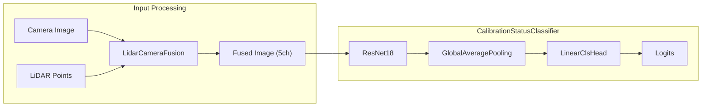

# Calibration Status Classifier

The Calibration Status Classifier detects whether camera-LiDAR calibration has drifted. It's a binary classification model that analyzes fused camera and LiDAR data to determine if recalibration is needed.

## Overview

| Property     | Value                                                    |
| ------------ | -------------------------------------------------------- |
| Task         | Binary Classification                                    |
| Input        | Fused RGB + Depth + Intensity image (5 channels)         |
| Output       | Calibration status (0: OK, 1: Needs recalibration)       |
| Architecture | ResNet18 backbone + Global Average Pooling + Linear Head |
| Datasets     | NuScenes, T4Dataset                                      |

## Architecture



### Input Channels

| Channel | Content                         |
| ------- | ------------------------------- |
| 0-2     | RGB from camera                 |
| 3       | Depth from LiDAR projection     |
| 4       | Intensity from LiDAR projection |

## Data Pipeline

### Transforms

```yaml
train_transforms:
  pipeline:
    - _target_: autoware_ml.transforms.camera.UndistortImage
      alpha: 0.0

    - _target_: autoware_ml.transforms.camera_lidar.CalibrationMisalignment
      p: 0.5
      min_angle: 1.0
      max_angle: 5.0

    - _target_: autoware_ml.transforms.camera_lidar.LidarCameraFusion
      max_depth: 128.0

    - _target_: autoware_ml.transforms.common.PermuteAxes
      input_keys: [fused_img]
      axes: [2, 0, 1]
```

**CalibrationMisalignment**: Artificially introduces calibration errors by rotating and translating LiDAR points before projection. This is how the model learns what miscalibration looks like.

**LidarCameraFusion**: Projects LiDAR points onto the camera image, creating depth and intensity channels.

## Training

### Quick Start

```bash
# Generate dataset info
autoware-ml create-dataset \
    --dataset nuscenes \
    --task calibration_status \
    --root-path /workspace/data/nuscenes \
    --out-dir /workspace/data/nuscenes/info

# Train
autoware-ml train --config-name tasks/calibration_status/resnet18_nuscenes
```

### Configuration

```yaml title="configs/tasks/calibration_status/resnet18_nuscenes.yaml"
defaults:
  - /tasks/calibration_status/resnet18_base
  - _self_

data_root: /workspace/data/nuscenes

datamodule:
  _target_: autoware_ml.datamodule.nuscenes.calibration_status.NuscenesCalibrationDataModule
  data_root: ${data_root}
  train_ann_file: ${data_root}/info/nuscenes_infos_train.pkl
  val_ann_file: ${data_root}/info/nuscenes_infos_val.pkl
```

## Deployment

```bash
autoware-ml deploy \
    --config-name calibration_status/resnet18_nuscenes \
    +checkpoint=mlruns/<date>/<time>/checkpoints/last.ckpt
```

### Dynamic Shapes

The model accepts variable input resolutions:

```yaml
deploy:
  onnx:
    dynamic_shapes:
      fused_img: { 2: height, 3: width }
  tensorrt:
    input_shapes:
      input:
        min_shape: [1, 5, 1080, 1920]
        opt_shape: [1, 5, 1440, 2560]
        max_shape: [1, 5, 2160, 3840]
```

## Files

| File                                                     | Purpose              |
| -------------------------------------------------------- | -------------------- |
| `autoware_ml/models/calibration_status/`                 | Model implementation |
| `autoware_ml/datamodule/nuscenes/calibration_status.py`  | NuScenes DataModule  |
| `autoware_ml/datamodule/t4dataset/calibration_status.py` | T4Dataset DataModule |
| `configs/tasks/calibration_status/`                      | Task configurations  |
